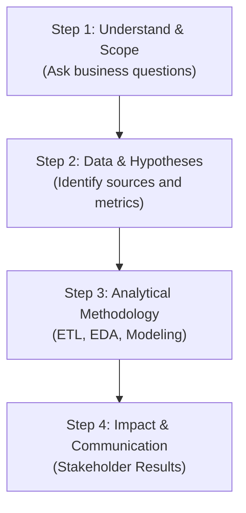

# Preparation for Analytics Interviews

## 1. The Importance of the Thought Process

In technical recruitment for analytics, data mining, and data engineering roles, interviews and coding assessments no longer focus solely on whether you memorize exact SQL syntax or Scikit-Learn function signatures. Interviewers primarily evaluate **how you reason through and solve complex problems**.

Structuring your thought process clearly demonstrates to employers that:
*   You navigate ambiguity (ill-defined business problems) effectively.
*   You test hypotheses systematically rather than jumping to conclusions.
*   You prioritize business impact over algorithmic complexity.
*   You communicate technical findings clearly to non-technical stakeholders.

---

## 2. The 4-Step Problem-Solving Framework

When presented with an open-ended business case or technical interview problem, avoid blurting out an immediate solution. Instead, use this 4-step framework to guide your interviewer through your solution:

### Step 1: Understand and Scope the Problem
*   **What to do**: Ask clarifying questions to define the problem's scope. Never make assumptions.
*   **Useful phrasing**:
    *   *"Before designing the schema, what is the primary business goal for this analysis?"*
    *   *"Are we measuring customer retention on a monthly or annual basis?"*

### Step 2: Formulate Hypotheses and Identify Data Sources
*   **What to do**: Propose required variables and data sources. Explain which assumptions you intend to validate.
*   **Useful phrasing**:
    *   *"My hypothesis is that churning customers exhibit low login frequency over the last 15 days. To test this, I need user activity logs and subscription tables."*

### Step 3: Define Analytical Methodology
*   **What to do**: Walk through your data pipeline step by step (from ingestion and EDA to model training and evaluation).
*   **Useful phrasing**:
    *   *"First, I'll clean and impute missing historical fields, then conduct exploratory data analysis (EDA) to evaluate feature correlations. If the goal is predictive, I'd train an XGBoost model evaluated primarily on Recall, as false negatives are costly here."*

### Step 4: Translate to Business Impact
*   **What to do**: Conclude by articulating how you would present actionable recommendations to executive stakeholders.
*   **Useful phrasing**:
    *   *"Finally, I would deliver an interactive dashboard highlighting estimated cost savings achieved by retaining 10% of high-risk customers identified by the model."*

---

## 3. Common Practice Interview Cases

### Case 1: Designing an Ingestion Pipeline
> **Interviewer Question**: *"Our mobile app generates millions of clickstream events per second, and we need daily analytics to optimize product recommendations. How would you design this architecture?"*

*   **Recommended approach**:
    1.  Classify processing requirements: Identify the hybrid nature (continuous streaming ingestion, batch analytical aggregation).
    2.  Propose cloud ecosystem tools: Recommend low-cost object storage (e.g., Google Cloud Storage) for raw streams and a distributed computing framework (e.g., PySpark) for nightly batch processing.
    3.  Incorporate governance: Highlight the need for a data catalog to index semi-structured JSON schemas.

### Case 2: Selecting Evaluation Metrics
> **Interviewer Question**: *"We built an e-commerce fraud detection model achieving 99% overall Accuracy. Should we deploy it to production?"*

*   **Recommended approach**:
    1.  Challenge the metric: Explain that on severely imbalanced datasets (e.g., fraud where only 0.1% of transactions are fraudulent), accuracy is misleading (a naive model predicting 'No Fraud' for everything yields 99.9% accuracy).
    2.  Propose appropriate metrics: Recommend **F1-Score**, **Precision**, or **Recall** depending on the relative business costs of False Positives (blocking legitimate customers) versus False Negatives (allowing fraudulent transactions).
