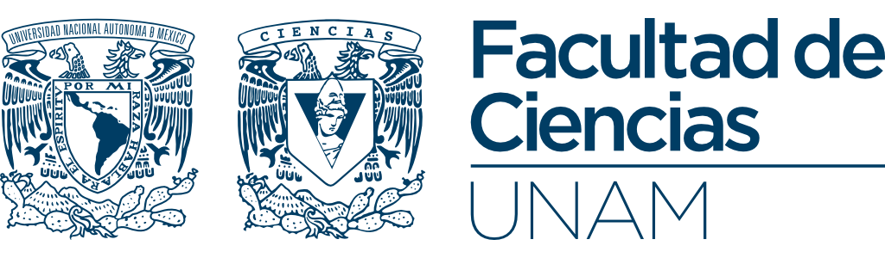

```{=html}
<style>
/* ── Ocultar el bloque de título que Quarto inyecta en index.qmd ── */
#title-block-header,
.quarto-title-block,
.quarto-title-meta  { display: none !important; }

/* ── Tokens ─────────────────────────────────────────────────────── */
:root {
  --amd-navy:   #0c2461;
  --amd-blue:   #1e3a8a;
  --amd-mid:    #2563eb;
  --amd-light:  #dbeafe;
  --amd-ink:    #1e293b;
  --amd-muted:  #64748b;
  --amd-border: #e2e8f0;
  --amd-surface:#f8fafc;
  --amd-r:      13px;
  --amd-ui:     system-ui, -apple-system, "Segoe UI", sans-serif;
  --amd-serif:  "Palatino Linotype", Palatino, Georgia, serif;
}

/* ── Barra institucional ────────────────────────────────────────── */
.amd-inst-bar {
  display: flex;
  align-items: center;
  justify-content: space-between;
  flex-wrap: wrap;
  gap: .6rem;
  padding: .85rem 1.2rem;
  background: #fff;
  border-top: 4px solid var(--amd-navy);
  border-left: 1px solid var(--amd-border);
  border-right: 1px solid var(--amd-border);
  border-bottom: 1px solid var(--amd-border);
  border-radius: var(--amd-r) var(--amd-r) 0 0;
}
.amd-inst-logo  { height: 3rem; display: block; }
.amd-inst-pill  {
  font-size: .7rem; font-weight: 700; letter-spacing: .06em;
  text-transform: uppercase; color: var(--amd-blue);
  background: var(--amd-light);
  padding: .22rem .75rem; border-radius: 100px;
  font-family: var(--amd-ui);
}

/* ── Hero ───────────────────────────────────────────────────────── */
.amd-hero {
  background: linear-gradient(140deg, var(--amd-surface) 0%, #eff6ff 100%);
  border: 1px solid var(--amd-border);
  border-top: none;
  border-radius: 0 0 var(--amd-r) var(--amd-r);
  padding: 2.5rem 2rem 2.3rem;
  margin-bottom: 2rem;
  position: relative; overflow: hidden;
}
.amd-hero::after {
  content: "";
  position: absolute; right: -80px; bottom: -80px;
  width: 260px; height: 260px; border-radius: 50%;
  background: radial-gradient(circle, rgba(37,99,235,.09) 0%, transparent 70%);
  pointer-events: none;
}
.amd-eyebrow {
  font-size: .72rem; font-weight: 700; letter-spacing: .09em;
  text-transform: uppercase; color: var(--amd-mid);
  margin-bottom: .5rem; font-family: var(--amd-ui);
}
.amd-hero-title {
  font-size: clamp(1.65rem, 3.5vw, 2.45rem);
  font-weight: 800; line-height: 1.16; color: var(--amd-ink);
  margin: 0 0 .65rem;
  font-family: var(--amd-serif);
}
.amd-hero-sub {
  font-size: 1rem; color: var(--amd-muted); max-width: 530px;
  line-height: 1.62; margin-bottom: 1.4rem;
  font-family: var(--amd-serif);
}
.amd-hero-meta {
  font-size: .76rem; color: #94a3b8; margin-bottom: 1.35rem;
  font-family: var(--amd-ui);
  display: flex; align-items: center; gap: .5rem; flex-wrap: wrap;
}
.amd-hero-meta .dot { color: #cbd5e1; }
.amd-btns        { display: flex; gap: .65rem; flex-wrap: wrap; }
.amd-btn {
  display: inline-block; padding: .52rem 1.2rem;
  border-radius: 9px; font-size: .875rem; font-weight: 600;
  text-decoration: none; transition: all .15s;
  font-family: var(--amd-ui);
}
.amd-btn-primary {
  background: var(--amd-blue); color: #fff;
  border: 2px solid transparent;
  box-shadow: 0 1px 8px rgba(30,58,138,.22);
}
.amd-btn-primary:hover { background: var(--amd-navy); color: #fff; text-decoration: none; }
.amd-btn-outline  {
  background: transparent; color: var(--amd-blue);
  border: 2px solid var(--amd-mid);
}
.amd-btn-outline:hover { background: var(--amd-light); color: var(--amd-navy); text-decoration: none; }

/* ── Stats ──────────────────────────────────────────────────────── */
.amd-stats {
  display: grid;
  grid-template-columns: repeat(auto-fit, minmax(128px, 1fr));
  gap: .75rem; margin-bottom: 2.6rem;
}
.amd-stat {
  border: 1px solid var(--amd-border); border-radius: 12px;
  padding: 1.05rem 1rem; text-align: center; background: #fff;
  transition: box-shadow .15s, transform .15s;
}
.amd-stat:hover { box-shadow: 0 4px 18px rgba(30,58,138,.09); transform: translateY(-2px); }
.amd-stat-num {
  font-size: 1.7rem; font-weight: 800; line-height: 1; color: var(--amd-blue);
  font-family: var(--amd-ui);
}
.amd-stat-lbl {
  font-size: .7rem; color: var(--amd-muted); margin-top: .28rem;
  text-transform: uppercase; letter-spacing: .05em; font-family: var(--amd-ui);
}

/* ── Section label ──────────────────────────────────────────────── */
.amd-label {
  font-size: .68rem; font-weight: 700; letter-spacing: .1em;
  text-transform: uppercase; color: var(--amd-mid);
  font-family: var(--amd-ui); margin-bottom: .3rem;
}
.amd-rule {
  height: 1px; background: var(--amd-border); margin-bottom: 1.2rem;
}

/* ── Learn cards ────────────────────────────────────────────────── */
.amd-learn-grid {
  display: grid;
  grid-template-columns: repeat(auto-fit, minmax(210px, 1fr));
  gap: .8rem; margin-bottom: 2.6rem;
}
.amd-learn-card {
  border: 1px solid var(--amd-border); border-radius: 11px;
  padding: 1rem 1.1rem; background: #fff;
  transition: border-color .15s, box-shadow .15s;
  border-left: 3px solid var(--amd-mid);
}
.amd-learn-card:hover { box-shadow: 0 3px 14px rgba(37,99,235,.09); }
.amd-learn-kw {
  font-size: .68rem; font-weight: 700; letter-spacing: .07em;
  text-transform: uppercase; color: var(--amd-mid);
  margin-bottom: .3rem; font-family: var(--amd-ui);
}
.amd-learn-title {
  font-size: .87rem; font-weight: 700; color: var(--amd-ink);
  margin-bottom: .28rem; font-family: var(--amd-ui);
}
.amd-learn-desc {
  font-size: .78rem; color: var(--amd-muted); line-height: 1.5;
  font-family: var(--amd-ui);
}

/* ── Syllabus ───────────────────────────────────────────────────── */
.amd-syllabus { margin-bottom: 2.6rem; }
.amd-part {
  border: 1px solid var(--amd-border); border-radius: 11px;
  overflow: hidden; margin-bottom: .55rem;
}
.amd-part-header {
  display: flex; align-items: center; gap: .65rem;
  padding: .78rem 1.1rem; background: #fff;
}
.amd-part-num {
  width: 26px; height: 26px; border-radius: 50%;
  background: var(--amd-light); color: var(--amd-blue);
  font-size: .73rem; font-weight: 800; flex-shrink: 0;
  display: flex; align-items: center; justify-content: center;
  font-family: var(--amd-ui);
}
.amd-part-name {
  font-size: .875rem; font-weight: 600; color: var(--amd-ink);
  font-family: var(--amd-ui);
}
.amd-part-count {
  font-size: .7rem; color: #94a3b8; margin-left: auto;
  white-space: nowrap; font-family: var(--amd-ui);
}
.amd-part-body {
  padding: .5rem 1.1rem .65rem 2.9rem;
  background: var(--amd-surface);
  border-top: 1px solid var(--amd-border);
}
.amd-chips     { display: flex; flex-wrap: wrap; gap: .32rem; }
.amd-chip {
  display: inline-block; padding: .19rem .6rem; border-radius: 100px;
  font-size: .7rem; font-weight: 500;
  background: #fff; border: 1px solid var(--amd-border);
  color: #475569; font-family: var(--amd-ui);
}

/* ── Prereqs ────────────────────────────────────────────────────── */
.amd-prereq-grid {
  display: grid;
  grid-template-columns: repeat(auto-fit, minmax(180px, 1fr));
  gap: .7rem; margin-bottom: 2.6rem;
}
.amd-prereq-card {
  border-left: 3px solid var(--amd-mid);
  border-top: 1px solid var(--amd-border);
  border-right: 1px solid var(--amd-border);
  border-bottom: 1px solid var(--amd-border);
  border-radius: 0 10px 10px 0;
  padding: .72rem .95rem; background: #fff;
}
.amd-prereq-t {
  font-size: .82rem; font-weight: 700; color: var(--amd-ink);
  margin-bottom: .18rem; font-family: var(--amd-ui);
}
.amd-prereq-d {
  font-size: .76rem; color: var(--amd-muted); line-height: 1.45;
  font-family: var(--amd-ui);
}

/* ── Instructor ─────────────────────────────────────────────────── */
.amd-instructor {
  display: flex; align-items: flex-start; gap: 1rem;
  border: 1px solid var(--amd-border); border-radius: 12px;
  padding: 1.2rem 1.35rem; background: #fff;
  margin-bottom: 2.4rem;
}
.amd-avatar {
  width: 48px; height: 48px; border-radius: 50%; flex-shrink: 0;
  background: var(--amd-navy); color: #fff;
  display: flex; align-items: center; justify-content: center;
  font-size: .85rem; font-weight: 700; letter-spacing: .04em;
  font-family: var(--amd-ui);
  border: 2px solid var(--amd-light);
}
.amd-i-name {
  font-size: .96rem; font-weight: 700; color: var(--amd-ink);
  margin-bottom: .13rem; font-family: var(--amd-ui);
}
.amd-i-role {
  font-size: .76rem; color: var(--amd-muted); margin-bottom: .32rem;
  font-family: var(--amd-ui);
}
.amd-i-bio {
  font-size: .79rem; color: var(--amd-muted); line-height: 1.55;
  font-family: var(--amd-ui);
}
.amd-i-link { color: var(--amd-mid); text-decoration: none; }
.amd-i-link:hover { color: var(--amd-navy); text-decoration: underline; }

/* ── Footer ─────────────────────────────────────────────────────── */
.amd-footer {
  display: flex; align-items: center; justify-content: space-between;
  flex-wrap: wrap; gap: 1rem;
  border-top: 1px solid var(--amd-border); padding-top: 1.3rem;
}
.amd-footer img  { height: 1.8rem; }
.amd-footer-txt {
  font-size: .72rem; color: #94a3b8; line-height: 1.5;
  font-family: var(--amd-ui); text-align: right;
}

/* ── Dark mode ──────────────────────────────────────────────────── */
[data-bs-theme="dark"] .amd-inst-bar,
[data-bs-theme="dark"] .amd-stat,
[data-bs-theme="dark"] .amd-learn-card,
[data-bs-theme="dark"] .amd-part-header,
[data-bs-theme="dark"] .amd-chip,
[data-bs-theme="dark"] .amd-prereq-card,
[data-bs-theme="dark"] .amd-instructor { background: #1e293b; }

[data-bs-theme="dark"] .amd-hero        { background: linear-gradient(140deg,#0f172a 0%,#1e293b 100%); }
[data-bs-theme="dark"] .amd-part-body   { background: #0f172a; }

[data-bs-theme="dark"] .amd-hero-title,
[data-bs-theme="dark"] .amd-learn-title,
[data-bs-theme="dark"] .amd-part-name,
[data-bs-theme="dark"] .amd-prereq-t,
[data-bs-theme="dark"] .amd-i-name      { color: #f1f5f9; }

[data-bs-theme="dark"] .amd-stat-num    { color: #60a5fa; }
[data-bs-theme="dark"] .amd-part-num    { background: #1e3a8a; color: #93c5fd; }
[data-bs-theme="dark"] .amd-inst-pill   { background: #1e3a8a; color: #93c5fd; }
[data-bs-theme="dark"] .amd-btn-outline { border-color: #3b82f6; color: #60a5fa; }
[data-bs-theme="dark"] .amd-btn-outline:hover { background: #1e3a8a; }
</style>

<!-- BARRA INSTITUCIONAL -->
<div class="amd-inst-bar">
  
  <span class="amd-inst-pill">
    Ciencias de la Computaci&oacute;n
  </span>
</div>

<!-- HERO -->
<div class="amd-hero">
  <p class="amd-eyebrow">Notas de curso &nbsp;&middot;&nbsp; Semestre 2026&ndash;II</p>
  <h2 class="amd-hero-title">
    Almacenes y Miner&iacute;a<br>de Datos
  </h2>
  <p class="amd-hero-sub">
    De los almacenes de datos y pipelines ETL con PySpark hasta la clasificaci&oacute;n
    supervisada, el clustering y la reducci&oacute;n de dimensionalidad &mdash;
    con rigor matem&aacute;tico, implementaciones en Python, pr&aacute;cticas en
    Databricks y m&aacute;s de 80&nbsp;visualizaciones interactivas.
  </p>
  <p class="amd-hero-meta">
    <span>Diego Villalba</span>
    <span class="dot">&middot;</span>
    <span>Facultad de Ciencias, UNAM</span>
    <span class="dot">&middot;</span>
    <span>CC BY-NC-SA 4.0</span>
  </p>
  <div class="amd-btns">
    <a class="amd-btn amd-btn-primary"
       href="unidades/almacenes/1-1-introduccion.html">
      Comenzar el curso &rarr;
    </a>
    <a class="amd-btn amd-btn-outline" href="#temario">
      Ver temario
    </a>
  </div>
</div>

<!-- STATS -->
<div class="amd-stats">
  <div class="amd-stat">
    <div class="amd-stat-num">5</div>
    <div class="amd-stat-lbl">Partes</div>
  </div>
  <div class="amd-stat">
    <div class="amd-stat-num">47+</div>
    <div class="amd-stat-lbl">Cap&iacute;tulos</div>
  </div>
  <div class="amd-stat">
    <div class="amd-stat-num">80+</div>
    <div class="amd-stat-lbl">Visualizaciones</div>
  </div>
  <div class="amd-stat">
    <div class="amd-stat-num">100%</div>
    <div class="amd-stat-lbl">Reproducible</div>
  </div>
</div>
```

## Prefacio {.unnumbered}

Estas notas cubren el ciclo completo del conocimiento basado en datos: diseño de almacenes analíticos, minería de patrones, preprocesamiento, clasificación supervisada y modelos probabilísticos. Cada tema combina desarrollo teórico con código ejecutable en Python.

```{=html}
<div class="amd-learn-grid">
  <div class="amd-learn-card">
    <div class="amd-learn-kw">Parte I</div>
    <div class="amd-learn-title">Almacenes de datos y ETL</div>
    <div class="amd-learn-desc">Arquitectura DW, modelo multidimensional, pipelines ETL/ELT con PySpark en Databricks, fuentes heterog&eacute;neas y cubos OLAP.</div>
  </div>
  <div class="amd-learn-card">
    <div class="amd-learn-kw">Parte II</div>
    <div class="amd-learn-title">Proceso de Miner&iacute;a de Datos</div>
    <div class="amd-learn-desc">CRISP-DM, EDA univariado y multivariado, preprocesamiento con sklearn Pipeline, imputaci&oacute;n, PCA y selecci&oacute;n de caracter&iacute;sticas.</div>
  </div>
  <div class="amd-learn-card">
    <div class="amd-learn-kw">Parte III</div>
    <div class="amd-learn-title">Extracci&oacute;n de Patrones</div>
    <div class="amd-learn-desc">Reglas de asociaci&oacute;n: Apriori y FP-Growth. M&eacute;tricas de soporte, confianza, lift, conviction y leverage.</div>
  </div>
  <div class="amd-learn-card">
    <div class="amd-learn-kw">Parte IV</div>
    <div class="amd-learn-title">Clasificaci&oacute;n Supervisada</div>
    <div class="amd-learn-desc">&Aacute;rboles CART, Random Forests, XGBoost, SVM, regresi&oacute;n log&iacute;stica, Bayes, GMM, redes neuronales y evaluaci&oacute;n con ROC-AUC.</div>
  </div>
  <div class="amd-learn-card">
    <div class="amd-learn-kw">Parte V</div>
    <div class="amd-learn-title">Aprendizaje No Supervisado</div>
    <div class="amd-learn-desc">K-Means, clustering jer&aacute;rquico, DBSCAN, t-SNE, UMAP y autoencoders para descubrir estructura latente sin etiquetas.</div>
  </div>
  <div class="amd-learn-card">
    <div class="amd-learn-kw">Transversal</div>
    <div class="amd-learn-title">Python &amp; Herramientas modernas</div>
    <div class="amd-learn-desc">PySpark, Databricks, Delta Lake, dbt, sklearn, PyTorch y JAX con visualizaciones interactivas en cada cap&iacute;tulo.</div>
  </div>
</div>
```

## Temario {.unnumbered #temario}

```{=html}
<div class="amd-syllabus">

  <div class="amd-part">
    <div class="amd-part-header">
      <span class="amd-part-num">I</span>
      <span class="amd-part-name">Almacenes de Datos</span>
      <span class="amd-part-count">8 cap&iacute;tulos</span>
    </div>
    <div class="amd-part-body">
      <div class="amd-chips">
        <span class="amd-chip">Arquitectura DW</span>
        <span class="amd-chip">Modelo multidimensional</span>
        <span class="amd-chip">ETL cl&aacute;sico vs ELT</span>
        <span class="amd-chip">PySpark &amp; Databricks</span>
        <span class="amd-chip">Fuentes heterog&eacute;neas JSON/CSV</span>
        <span class="amd-chip">Delta Lake</span>
        <span class="amd-chip">dbt &amp; Airflow</span>
        <span class="amd-chip">Cubos OLAP</span>
      </div>
    </div>
  </div>

  <div class="amd-part">
    <div class="amd-part-header">
      <span class="amd-part-num">II</span>
      <span class="amd-part-name">Proceso de Miner&iacute;a de Datos</span>
      <span class="amd-part-count">17 cap&iacute;tulos</span>
    </div>
    <div class="amd-part-body">
      <div class="amd-chips">
        <span class="amd-chip">CRISP-DM</span>
        <span class="amd-chip">EDA univariado</span>
        <span class="amd-chip">Localizaci&oacute;n &middot; Variabilidad &middot; Forma</span>
        <span class="amd-chip">Heterogeneidad &middot; Concentraci&oacute;n</span>
        <span class="amd-chip">Correlaci&oacute;n &middot; Multivariado</span>
        <span class="amd-chip">sklearn Pipeline</span>
        <span class="amd-chip">Imputaci&oacute;n &middot; Ruido</span>
        <span class="amd-chip">PCA &middot; Selecci&oacute;n &chi;&sup2;</span>
      </div>
    </div>
  </div>

  <div class="amd-part">
    <div class="amd-part-header">
      <span class="amd-part-num">III</span>
      <span class="amd-part-name">Extracci&oacute;n de Patrones</span>
      <span class="amd-part-count">3 cap&iacute;tulos</span>
    </div>
    <div class="amd-part-body">
      <div class="amd-chips">
        <span class="amd-chip">Apriori</span>
        <span class="amd-chip">FP-Growth</span>
        <span class="amd-chip">Soporte &middot; Confianza &middot; Lift</span>
        <span class="amd-chip">Conviction &middot; Leverage &middot; Zhang</span>
      </div>
    </div>
  </div>

  <div class="amd-part">
    <div class="amd-part-header">
      <span class="amd-part-num">IV</span>
      <span class="amd-part-name">Clasificaci&oacute;n Supervisada</span>
      <span class="amd-part-count">14 cap&iacute;tulos</span>
    </div>
    <div class="amd-part-body">
      <div class="amd-chips">
        <span class="amd-chip">&Aacute;rboles CART</span>
        <span class="amd-chip">Bagging &middot; Random Forests</span>
        <span class="amd-chip">XGBoost &middot; SHAP</span>
        <span class="amd-chip">Regresi&oacute;n log&iacute;stica</span>
        <span class="amd-chip">SVM &middot; Kernels</span>
        <span class="amd-chip">Bayes &middot; GMM</span>
        <span class="amd-chip">Redes neuronales &middot; CNN</span>
        <span class="amd-chip">PyTorch &middot; JAX</span>
        <span class="amd-chip">ROC &middot; AUC &middot; k-fold</span>
      </div>
    </div>
  </div>

  <div class="amd-part">
    <div class="amd-part-header">
      <span class="amd-part-num">V</span>
      <span class="amd-part-name">Aprendizaje No Supervisado</span>
      <span class="amd-part-count">5 cap&iacute;tulos</span>
    </div>
    <div class="amd-part-body">
      <div class="amd-chips">
        <span class="amd-chip">M&eacute;tricas de clustering</span>
        <span class="amd-chip">K-Means &middot; K-Medoids</span>
        <span class="amd-chip">Jer&aacute;rquico &middot; Ward</span>
        <span class="amd-chip">DBSCAN &middot; HDBSCAN</span>
        <span class="amd-chip">t-SNE &middot; UMAP</span>
        <span class="amd-chip">Autoencoders</span>
      </div>
    </div>
  </div>

</div>
```

## Requisitos previos {.unnumbered}

Orientado a estudiantes de Ciencias de la Computación, Matemáticas, Física y carreras afines.

```{=html}
<div class="amd-prereq-grid">
  <div class="amd-prereq-card">
    <div class="amd-prereq-t">C&aacute;lculo y &Aacute;lgebra Lineal</div>
    <div class="amd-prereq-d">Derivadas parciales, gradientes, operaciones con matrices y valores propios.</div>
  </div>
  <div class="amd-prereq-card">
    <div class="amd-prereq-t">Probabilidad y Estad&iacute;stica</div>
    <div class="amd-prereq-d">Variables aleatorias, distribuciones, esperanza, varianza y teorema de Bayes.</div>
  </div>
  <div class="amd-prereq-card">
    <div class="amd-prereq-t">Programaci&oacute;n en Python</div>
    <div class="amd-prereq-d">Nivel b&aacute;sico&ndash;intermedio: numpy, pandas y manejo de datos tabulares.</div>
  </div>
  <div class="amd-prereq-card">
    <div class="amd-prereq-t">Bases de Datos</div>
    <div class="amd-prereq-d">SQL b&aacute;sico y modelo relacional (recomendable, no indispensable).</div>
  </div>
</div>
```

## Autor {.unnumbered}

```{=html}
<div class="amd-instructor">
  <div class="amd-avatar">DV</div>
  <div>
    <div class="amd-i-name">Diego Villalba</div>
    <div class="amd-i-role">
      Facultad de Ciencias &nbsp;&middot;&nbsp;
      Universidad Nacional Aut&oacute;noma de M&eacute;xico
    </div>
    <div class="amd-i-bio">
      Estas notas conectan la teor&iacute;a matem&aacute;tica con implementaciones
      reproducibles en Python, priorizando intuici&oacute;n geom&eacute;trica
      y rigor formal en igual medida.&nbsp;
      <a class="amd-i-link"
         href="mailto:diego.villalba@ciencias.unam.mx">
        Contacto: diego.villalba@ciencias.unam.mx
      </a>
    </div>
  </div>
</div>

<!-- FOOTER -->
<div class="amd-footer">
  
  <div class="amd-footer-txt">
    Almacenes y Miner&iacute;a de Datos &nbsp;&middot;&nbsp; Facultad de Ciencias, UNAM<br>
    Licencia Creative Commons BY-NC-SA 4.0
  </div>
</div>
```
