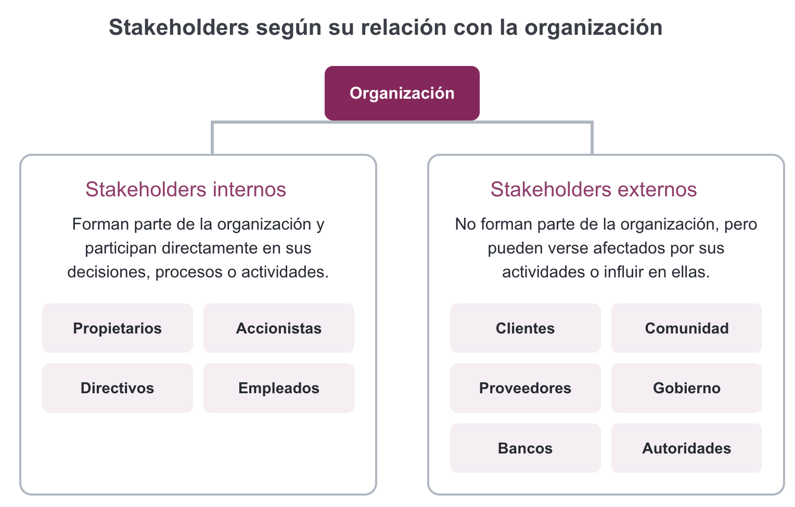
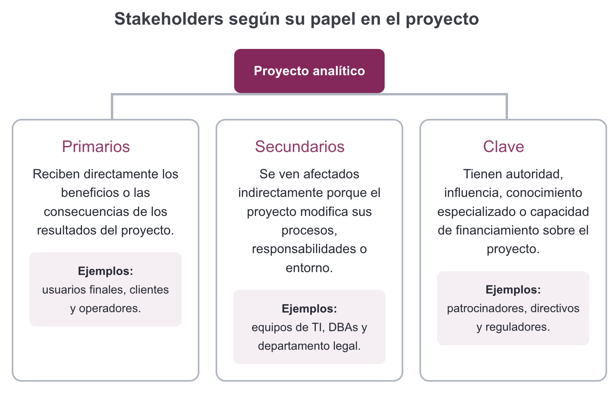
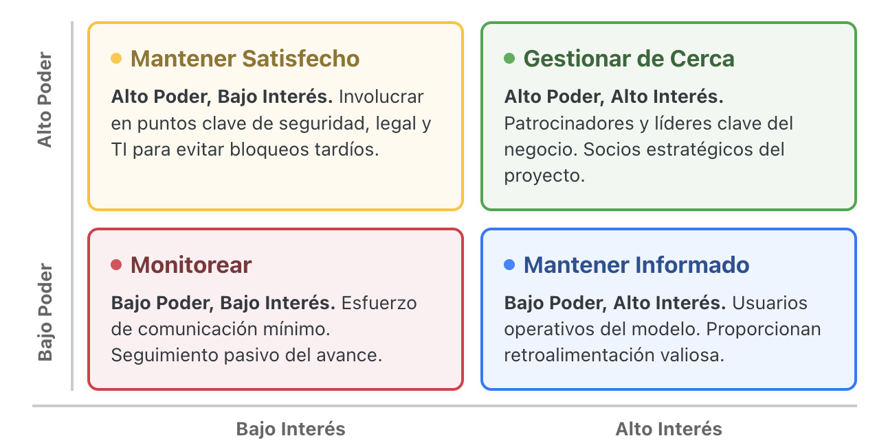

## Datos de contacto

Nombre y formación
<strong>Diego Villalba</strong>
Físico de formación

Posgrado
<strong>Maestría en Ciencia e Ingeniería de la Computación</strong>
IIMAS · UNAM

Experiencia profesional
<strong>ML Engineer</strong>
Prosperia

Intereses actuales

Modelos visión-lenguaje para diagnóstico médico
Interpretabilidad mecanística
Eficiencia de LLM mediante cuantización

Contacto y perfiles

<a href="mailto:diego.villalba@ciencias.unam.mx">diego.villalba@ciencias.unam.mx</a>
<a href="https://www.linkedin.com/in/diego-villalba-8ea7f8">LinkedIn</a>
<a href="https://diegoviillalba.github.io/">Página personal</a>

::: {.notes}
**Portada, 0:00–0:20.** “Hoy no comenzaremos con una base de datos ni con un algoritmo. Comenzaremos con alguien que pide ayuda y con una pregunta: ¿cómo convertimos esa petición en algo que realmente mejore una decisión?” Pausa de dos segundos y avanzar.

**Propósito.** Presentar brevemente la formación académica, la experiencia profesional, los intereses actuales y los canales de contacto del ayudante.

**Guion.** “Soy físico de formación, estudio la Maestría en Ciencia e Ingeniería de la Computación en el IIMAS de la UNAM y trabajo como ML Engineer en Prosperia. Actualmente me interesan los modelos visión-lenguaje para diagnóstico médico, la interpretabilidad mecanística y hacer más eficientes los LLM mediante cuantización. Para asuntos de esta clase pueden escribirme al correo que aparece aquí.”

**Pregunta.** “¿Qué conexión encuentran entre estos tres ámbitos y el tema de la sesión?” Esperar una respuesta breve.

**Error frecuente.** Extender la presentación personal; mantenerla por debajo de tres minutos.

**Duración.** 0:20–2:00. Señal para avanzar: el grupo identifica el correo de contacto.

**Si falta tiempo.** Mencionar únicamente formación, trabajo, un interés actual y correo.
:::

---

## Materiales del curso

El contenido que veremos durante el curso estará disponible en este sitio:

<a class="pa-course-url" href="https://diegoviillalba.github.io/almacenamienes-y-mineria-de-datos/">diegoviillalba.github.io/ almacenamienes-y-mineria-de-datos/</a>

Preparación clase a clase
<strong>Al final de cada sesión les adelantaré los temas de la siguiente.</strong>
Así podrán revisar el material con anticipación y llegar preparados.

Videos de clase
<strong>Dependiendo de la disponibilidad, podrán acceder a los videos de cada clase.</strong>
Esto sta sujeto a la disponibilidad del grupo.

<figure class="pa-course-qr">

<figcaption>Escanea para acceder</figcaption>
</figure>

::: {.notes}
**Propósito.** Mostrar dónde se concentra el contenido del curso y establecer la rutina de preparación entre sesiones.

**Guion.** “En este sitio encontrarán el contenido que iremos trabajando. Al terminar cada clase les diré qué temas veremos en la siguiente, para que puedan revisar el material con anticipación y llegar mejor preparados.”

**Acción.** Dar unos segundos para escanear el QR. Señalar que el enlace escrito también es seleccionable en la versión HTML.

**Duración.** 2:00–3:00. Señal para avanzar: al menos una persona confirma que pudo abrir el sitio.

**Si falla el QR.** Pedir que escriban o abran el enlace visible; no dedicar más de un minuto a resolver problemas de conexión.
:::

---

## Las afinidades aparecen antes que los equipos

Hola<strong>Tu nombre</strong>

1<strong>Un problema que te gustaría comprender con datos</strong>

2<strong>Una habilidad o forma de contribuir</strong>

3<strong>Algo que deseas aprender</strong>

{style="width: 5%; margin: 1rem auto; display: block;"}

En tríos · 80 segundos por persona · también puedes responder por escrito

::: {.notes}
**Propósito.** Romper el hielo y generar información útil para futuros equipos.

**Frase de inicio.** “No buscamos formar equipos hoy; buscamos señales de con quién podría ser útil volver a conversar.”

**Formación rápida.** Pedir tríos con las personas más cercanas. Si el número no es divisible entre tres, aceptar una pareja o un grupo de cuatro.

**Accesibilidad.** Quien prefiera no hablar puede escribir las cuatro señales y mostrarlas o entregarlas. No pedir información personal sensible.

**Duración.** 3:00–4:00. Avanzar cuando todos estén agrupados.

**Variantes.** Pocos estudiantes: parejas. Grupo muy grande: tríos sin plenaria. Virtual: salas de tres y documento compartido. Híbrida: agrupar por modalidad para no aislar a una persona remota.
:::

---

## Tres señales para encontrar colaboradores

<strong>4 min</strong>Cada persona comparte sus cuatro señales

<strong>1 min</strong>Encuentren una coincidencia y una diferencia valiosa

<strong>Producto:</strong> una coincidencia + una diferencia + un registro breve de intereses.

::: {.notes}
**Propósito.** Dar tiempo protegido para que todas las voces aparezcan y producir el primer registro de afinidades.

**Facilitación.** Iniciar el conteo cuando todos estén listos. Circular sin intervenir en el contenido.

**Avisos.** A los dos minutos: “Aseguren que todas las personas hayan hablado”. A los cinco minutos: “Pasen a coincidencia y diferencia”. A treinta segundos: “Escriban una frase por cada una”.

**Recuperar atención.** “Terminen la frase actual; miren al frente en cinco, cuatro, tres…”

**Evidencia.** Cada grupo debe poder mostrar dos frases, no solo decir que conversó.

**Duración.** 4:00–9:00.

**Si falta tiempo.** Hacer rondas de 60 segundos y registrar solo la coincidencia.
:::

---

## Una coincidencia une; una diferencia fortalece

Coincidencia
<strong>¿Qué problema o aprendizaje compartieron?</strong>

Diferencia valiosa
<strong>¿Qué aportaría una perspectiva distinta?</strong>

Estas señales serán insumo para comparar problemas y formar equipos más adelante.

::: {.notes}
**Propósito.** Conectar explícitamente el rompehielo con el proyecto progresivo.

**Pregunta.** Solicitar una coincidencia y una diferencia a dos grupos distintos. Máximo quince segundos por respuesta.

**Explicación.** Un equipo no necesita personas idénticas: necesita interés compartido y contribuciones complementarias.

**Duración.** 9:00–10:00.

**Si falta tiempo.** Recoger los registros sin plenaria y pronunciar solo la frase de cierre.
:::

---

## Un pedido detallado todavía puede ser ambiguo

<blockquote class="pa-request">
“Las ventas de ropa de mujer bajaron este mes. Necesito un reporte con todos los clientes y sus compras para lanzar un descuento.”
</blockquote>

- ¿Qué significa <strong>“bajaron”</strong>?
- ¿Por qué <strong>“todos”</strong> los clientes?
- ¿El <strong>descuento</strong> ya es la decisión?

::: {.notes}
**Propósito.** Crear tensión cognitiva antes de introducir definiciones.

**Consigna.** Leer la solicitud una vez y pedir: “Marquen mentalmente dos palabras que admiten más de una interpretación”. Pausa de veinte segundos y conversación con la persona de al lado.

**Revelado.** Mostrar cada pregunta solo después de escuchar propuestas. Las respuestas del grupo pueden ser distintas.

**Respuestas plausibles.** Bajaron respecto al mes anterior, al mismo mes del año pasado o al plan; clientes activos, históricos o de cierta categoría; el descuento puede ser una hipótesis, no la decisión final.

**Error frecuente.** Discutir de inmediato columnas o SQL.

**Duración.** 10:00–13:00.

**Si falta tiempo.** Recoger únicamente “bajaron” y “descuento”.
:::

---

## “Necesito datos” no dice qué decisión mejorar

Una petición vaga se aclara mediante conversación; la conversación identifica una decisión y la decisión se traduce en un objetivo analítico que define la evidencia necesaria.

Petición<strong>“Necesito un reporte”</strong>

→

Conversación<strong>¿Qué falta aclarar?</strong>

→

Decisión<strong>¿Qué acción debe mejorar?</strong>

→

Objetivo<strong>¿Qué evidencia necesita?</strong>

¿Cómo pasamos de “necesito datos” a un proyecto que realmente ayuda a decidir?

{style="width: 1%; margin: 1rem auto; display: block;"}

Caso didáctico · cadena de retail

<strong>“Queremos un Dashboard de Clientes 360 para entenderlos mejor y ser una empresa data-driven.”</strong>
<small>No se define qué acción cambiará, qué problema resolverá ni qué umbral activará una respuesta.</small>

::: {.notes}
**Propósito.** Instalar la pregunta conductora y el primer modelo mental.

**Predicción.** Mostrar solo la petición. Preguntar: “¿Cuál debería ser el siguiente paso: pedir la tabla, elegir una técnica o conversar sobre la decisión?” Pedir voto a mano alzada y una justificación.

**Revelado.** Avanzar conversación → decisión → objetivo, explicando una frase por nodo. Finalmente, revelar la petición del Dashboard 360 y preguntar: “¿Dónde está la decisión?”. El objetivo final aún no se formula.

**Error frecuente.** Presentar “datos” como nodo obligatorio antes de comprender la decisión.

**Duración.** 13:00–14:30.

**Si falta tiempo.** Mostrar el flujo completo después de un único voto y leer solo la primera frase del caso.
:::

---

## Dashboard 360: mucha información, ninguna decisión

El equipo trabaja tres meses integrando datos y construye más de veinte gráficas. Marketing y Operaciones no encuentran una acción concreta. Tres semanas después, el tablero registra cero visitas y queda archivado.

1 · Tres meses
<strong>Integrar y medir</strong>

ERP + web; tráfico físico/digital, demografía, frecuencia, ticket y productos vistos.

2 · Lanzamiento
<strong>Más de 20 gráficas</strong>

Marketing dice “qué interesante”; Operaciones no encuentra cómo actuar sobre el inventario.

3 · Tres semanas después
<strong>Cero visitas semanales</strong>

Las campañas siguen por intuición y el reporte queda archivado.

La diferencia: empezar por la decisión

¿A qué segmento contactar hoy, con qué oferta y bajo qué criterio?

::: {.notes}
**Propósito.** Mostrar que un producto técnicamente correcto puede fracasar si no está conectado con una decisión concreta.

**Guion.** Revelar una etapa a la vez. Enfatizar que limpiar e integrar datos sí aporta valor técnico, pero no garantiza uso. Tras “cero visitas”, preguntar: “¿Qué faltó definir antes del primer mes de trabajo?”.

**Cierre.** Revelar la pregunta de decisión. Aclarar que el error no fue usar Power BI o Tableau, sino construir antes de acordar quién actuaría, sobre qué unidad, con qué capacidad y bajo qué umbral.

**Duración.** 14:30–16:00. Señal para avanzar: alguien formula una acción concreta que el tablero debería apoyar.

**Si falta tiempo.** Mostrar las tres etapas juntas y contrastar únicamente “20 gráficas” con “cero visitas”.
:::

---

## Antes de los datos están las personas involucradas

Alrededor de la decisión están Mercadotecnia, que solicita y actúa; Categoría e inventario, que aportan contexto; Clientes, que reciben consecuencias; y Finanzas y privacidad, que validan o pueden bloquear.

Decisión<strong>comercial</strong>

<strong>Mercadotecnia</strong><small>solicita y actúa</small>

<strong>Categoría e inventario</strong><small>aporta contexto</small>

<strong>Clientes</strong><small>reciben consecuencias</small>

<strong>Finanzas y privacidad</strong><small>validan o bloquean</small>

<strong>Stakeholder:</strong> persona, grupo u organización que puede influir, aportar, bloquear o verse afectada por el proyecto o la decisión.

Apoyo conceptual: Bryson (2004), <a href="https://doi.org/10.1080/14719030410001675722">doi:10.1080/14719030410001675722</a>.

::: {.notes}
**Propósito.** Ampliar la intuición de stakeholder más allá de quien solicita el reporte.

**Pregunta.** Antes de revelar actores: “¿Quién podría cambiar, habilitar, bloquear o vivir las consecuencias de esta decisión?” Escribir mentalmente cuatro verbos: solicitar, usar, validar, resultar afectado.

**Revelado.** Agregar un actor por respuesta del grupo. Revelar clientes aunque nadie los mencione y preguntar por qué suelen olvidarse.

**Aclaración.** Stakeholder no significa únicamente cliente, usuario o persona favorable al proyecto.

**Duración.** 16:00–20:00.

**Si falta tiempo.** Dar Mercadotecnia y Clientes como semillas y pedir dos actores más.
:::

---

## Dos lentes describen relaciones distintas

{style="width: 10%; margin: 1rem auto; display: block;"}

---

## Dos lentes describen relaciones distintas

{style="width: 10%; margin: 1rem auto; display: block;"}

<strong>Privacidad/legal</strong> puede ser interno + secundario + clave al mismo tiempo.

::: {.notes}
**Propósito.** Evitar que los dos sistemas de clasificación se mezclen o se traten como excluyentes.

**Actividad.** Pedir que clasifiquen primero a Clientes y luego a Privacidad/legal usando ambos lentes. Exigir una razón, no solo una etiqueta.

**Punto clave.** “Clave” puede superponerse con primario o secundario. La respuesta depende del alcance: si cambia el uso de datos personales, privacidad gana poder; si no, su posición puede variar.

**Error frecuente.** Interno = primario o externo = secundario.

**Duración.** 20:00–25:00.

**Si falta tiempo.** Clasificar únicamente Privacidad/legal para demostrar la superposición.
:::

---

## Ejemplo: Aeropuerto internacional

---

## Poder e interés orientan cómo involucrar

{style="width: 10%; margin: 1rem auto; display: block;"}

<strong>Hipótesis para discutir:</strong> la posición cambia con el alcance y la fase.

Marco y estrategias: <a href="https://www.pmi.org/learning/library/planning-effective-stakeholder-management-strategies-development-6058">PMI</a>; antecedente comúnmente asociado: <a href="https://aisel.aisnet.org/icis1981/20/">Mendelow (1981)</a>.

::: {.notes}
**Propósito.** Convertir el análisis de actores en una decisión de involucramiento.

**Definiciones.** Poder: capacidad contextual para habilitar, modificar, bloquear o legitimar. Interés: cuánto importa el proceso o resultado; no implica apoyo.

**Predicción.** Dibujar mentalmente la matriz vacía y pedir ubicación para Mercadotecnia y Clientes. Preguntar “¿qué supuesto cambiaría esa posición?”

**Revelado.** Mostrar actores uno por uno después de escuchar propuestas. Aceptar otra ubicación si está bien argumentada.

**Seguimiento.** ¿Qué comunicación requiere cada cuadrante? ¿Quién debe validar, quién necesita información y quién participa en decisiones?

**Fuente para notas.** El marco se asocia comúnmente con Mendelow y ha sido adaptado ampliamente en gestión de proyectos; evitar afirmar un origen inequívoco de las cuatro etiquetas.

**Duración.** 25:00–29:00.

**Si falta tiempo.** Ubicar solo Mercadotecnia, Clientes y Privacidad.
:::

---

## El grupo debe convertir el pedido en una decisión

<strong>3 min</strong>4–6 actores + clasificación

<strong>2 min</strong>Matriz + involucramiento

<strong>2 min</strong>Tres preguntas

<strong>3 min</strong>Objetivo provisional + algo por validar

<strong>Producto de una hoja</strong>
Personas · supuestos · preguntas · decisión · objetivo · algo pendiente de validar

“Analizar [resultado] en [población] durante [periodo] para que [actor] decida [acción], sujeto a [capacidad], y observar [medida].”

::: {.notes}
**Propósito.** Dar una consigna verificable y reducir la carga de coordinación.

**Roles.** Facilitador, escriba, guardián del tiempo y relator. En tríos se pueden combinar roles.

**Comprobación.** Pedir a una persona que repita qué debe existir en la hoja al terminar.

**Ejemplo mínimo.** Leer únicamente la estructura de la oración; no dar una solución del caso.

**Material.** Usar `01-materiales-actividades.md`, sección “Canvas del caso”.

**Duración.** 29:00–30:00.

**Si falta tiempo.** Exigir cuatro actores, tres preguntas y una oración de objetivo.
:::

---

## Primero personas y preguntas; después datos

<strong>1 · Personas</strong>¿Quién decide, aporta, bloquea o resulta afectado?

<strong>2 · Prioridad</strong>¿Dónde está y cómo lo involucramos?

<strong>3 · Preguntas</strong>¿Qué necesitamos aclarar antes de pedir datos?

<strong>4 · Reformulación</strong>Población + resultado + periodo + decisión + capacidad + medida inicial

Si se bloquean: empiecen por “¿quién decide?” y “¿quién vive la consecuencia?”.

::: {.notes}
**Propósito.** Integrar identificación, priorización y reformulación en un producto observable.

**Facilitación.** Mantener esta slide visible. Circular y preguntar, no corregir directamente.

**Avisos.** Minuto 3: “Pasen a matriz”. Minuto 5: “Necesitan tres preguntas”. Minuto 7: “Escriban ya la oración, aunque sea imperfecta”. Minuto 8: “Marquen qué falta validar”.

**Preguntas de desbloqueo.** ¿Qué significa “bajaron”? ¿Quién puede detener la campaña? ¿Pueden actuar sobre todos los clientes? ¿Cómo sabrían si la campaña funcionó?

**Errores frecuentes.** Copiar la petición; escribir “hacer clustering”; omitir periodo o comparación; confundir ventas, unidades, ingresos y margen; ignorar inventario o capacidad.

**Duración.** 30:00–40:00.

**Versión de 50 minutos.** Cuatro actores; doble clasificación para dos; tres actores en matriz; una estrategia; tres preguntas; una oración.
:::

---

## Respuestas distintas pueden ser válidas si explican sus supuestos

Grupo A
<strong>¿Qué actor priorizó?</strong>
¿Qué supuesto lo llevó allí?

Grupo B
<strong>¿Qué decisión formuló?</strong>
¿Qué término dejó por validar?

Reporte relámpago: 45 segundos por grupo.

::: {.notes}
**Propósito.** Contrastar razonamientos sin imponer una clasificación única.

**Socialización.** Elegir dos grupos con diferencias útiles. Grupo A reporta un actor y su ubicación; Grupo B, su objetivo y una incertidumbre.

**Preguntas de seguimiento.** “¿Qué supuesto cambia entre ambas respuestas?” “¿Qué evidencia permitiría decidir entre ellas?”

**Respuesta plausible.** Privacidad puede tener alto poder si la campaña usa datos sensibles; Categoría puede ser clave si el inventario limita la acción.

**Error frecuente.** Permitir que cada grupo lea toda la hoja.

**Duración.** 40:00–43:00.

**Si falta tiempo.** Un solo reporte y una comparación del docente.
:::

---

## Un objetivo útil se refina y se valida

El refinamiento recorre contexto, decisión, medición, alcance, validación y reformulación. La reformulación es provisional y vuelve a validarse.

1<strong>Contexto</strong><small>¿qué cambió?</small>

2<strong>Decisión</strong><small>¿qué acción?</small>

3<strong>Medición</strong><small>¿qué significa éxito?</small>

4<strong>Alcance</strong><small>¿quién, cuándo, cuánto?</small>

5<strong>Validación</strong><small>¿quién confirma?</small>

6<strong>Reformulación</strong><small>provisional</small>

Antes: “reporte de todos los clientes”
<strong>Después: población + resultado + periodo + decisión + capacidad + medida</strong>

::: {.notes}
**Propósito.** Formalizar después de practicar y mostrar que el refinamiento es iterativo.

**Revelado.** Antes de cada paso, pedir un ejemplo del canvas. Contexto: referencia de la caída. Decisión: campaña, inventario o segmentación. Medición: margen, conversión u otro resultado. Alcance: población, periodo y capacidad. Validación: dueño de la decisión y actores clave.

**Reformulación plausible, no solución única.** “Comparar la variación reciente de compras de ropa de mujer entre segmentos relevantes para que Mercadotecnia priorice una campaña limitada por inventario y capacidad, evaluada inicialmente mediante cambio en conversión y margen frente a un grupo de comparación.” Señalar que una comparación antes/después no basta para atribuir causalidad.

**Pregunta.** “¿Qué término todavía admitiría dos interpretaciones?”

**Punto clave.** Aún no corresponde elegir algoritmo. Primero se valida el objetivo y luego se investigan datos y métodos.

**Data Request Ticket.** Nombrarlo como registro posterior de acuerdos: necesidad, decisión, alcance, criterios, restricciones, responsables y fecha útil. No sustituye la conversación.

**Fuente de apoyo.** Chapman et al., *CRISP-DM 1.0*, fase Business Understanding: <https://www.kde.cs.uni-kassel.de/lehre/ws2012-13/kdd/files/CRISPWP-0800.pdf>.

**Duración.** 43:00–49:00.

**Si falta tiempo.** Mostrar la síntesis completa y profundizar solo en decisión, alcance y validación.
:::

---

## Las afinidades sirven para comparar problemas, no soluciones

01<strong>Dos áreas problemáticas</strong>

02<strong>Una habilidad que aportas</strong>

03<strong>Una habilidad por desarrollar</strong>

04<strong>Modalidad y dos conversaciones útiles</strong>

No todavía: “quiero usar redes neuronales”
<strong>Mejor:</strong> “quiero comprender qué factores se asocian con el abandono y qué intervención convendría evaluar”

::: {.notes}
**Propósito.** Transferir el modelo mental a intereses personales sin convertir afinidades en equipos definitivos.

**Frase de seguridad.** “Esto es un mapa provisional de afinidades, no una selección pública ni un compromiso de equipo.”

**Aclaración.** Si alguien escribe una tecnología, preguntar: “¿Qué situación o decisión te gustaría comprender con ella?”

**Material.** Usar la ficha de afinidades de `01-materiales-actividades.md`.

**Duración.** 49:00–50:00.

**Si falta tiempo.** Integrar la explicación con la siguiente slide.
:::

---

## Registra qué problema te mueve y cómo puedes contribuir

<strong>Nombre</strong>________________

<strong>Área 1</strong>________________

<strong>Área 2</strong>________________

<strong>Aporto</strong>________________

<strong>Quiero desarrollar</strong>________________

<strong>Modalidad/disponibilidad</strong>________________

<strong>Dos conversaciones útiles</strong>________________ · ________________

Hoy registramos señales; en la próxima sesión compararemos problemas.

::: {.notes}
**Propósito.** Producir el insumo individual para formación posterior de equipos.

**Facilitación.** Dar cuatro minutos de escritura silenciosa. Durante el último minuto, pedir que completen los nombres de dos personas con quienes conversaron de forma útil. Se puede entregar de manera privada.

**Inclusión.** No exigir leer intereses o disponibilidad en público. Aceptar ficha digital, escrita o completada después si la persona necesita más tiempo.

**Uso del registro.** Explicar que lo revisará el equipo docente únicamente para comparar afinidades en la formación posterior; la disponibilidad es opcional y puede dejarse en blanco.

**Evidencia.** Verificar que las dos áreas describan situaciones o decisiones, no algoritmos.

**Duración.** 50:00–56:00, incluyendo el puente de un minuto.

**Si falta tiempo.** Completar en clase los primeros cinco campos y añadir conversaciones después.
:::

---

## De la necesidad al proyecto hay una cadena de decisiones

La progresión completa es necesidad, personas involucradas, preguntas de aclaración, decisión, objetivo analítico y posible proyecto de datos.

1<strong>Necesidad</strong>

→

2<strong>Personas</strong>

→

3<strong>Preguntas</strong>

→

4<strong>Decisión</strong>

→

5<strong>Objetivo</strong>

→

6<strong>Proyecto</strong>

Pasamos de “necesito datos” a un proyecto útil comprendiendo a las personas, aclarando la decisión y acordando un objetivo analítico validable. <strong>Después</strong> investigamos datos y métodos.

1 · ¿Qué preguntarías antes de pedir datos?
2 · ¿Qué problema te interesaría explorar?
3 · ¿Qué habilidad o interés aportarías?
4 · ¿Qué duda todavía tienes?

::: {.notes}
**Propósito.** Recuperar el argumento completo, responder explícitamente la pregunta conductora y comprobar transferencia individual.

**Recuperación.** Pedir a la clase que anticipe el siguiente nodo antes de cada avance. No narrar la cadena completa sin participación.

**Respuesta explícita.** Leer la caja final y enfatizar “después”. Un proyecto útil no ignora los datos ni los algoritmos; los sitúa después de comprender la necesidad y la decisión.

**Ticket.** Dar respuestas de una frase. Puede entregarse en papel o en el canal del curso. Las dudas abrirán la próxima sesión.

**Duración.** 56:00–59:00.

**Si falta tiempo.** Conservar preguntas 1 y 2 en clase; permitir completar 3 y 4 después.
:::

---

## La próxima sesión traeremos problemas, no algoritmos

1<strong>Dos posibles problemas</strong><small>No dos soluciones</small>

2<strong>Quién los vive y quién decide</strong><small>Personas concretas</small>

3<strong>Qué decisión podría mejorar</strong><small>Una acción posible</small>

4<strong>Cómo observaríamos el resultado</strong><small>Una primera señal de valor</small>

Un proyecto de datos útil no comienza con el algoritmo; comienza comprendiendo a las personas, la decisión y el problema.

::: {.notes}
**Propósito.** Convertir el cierre en preparación concreta para la siguiente sesión.

**Guion.** Pedir que cada persona escriba ahora el nombre provisional de un problema que podría traer. No evaluarlo todavía.

**Recordatorio.** No elegir algoritmos, modelos, plataformas ni tecnologías. La siguiente sesión comparará problemas por valor, personas involucradas, decisión y resultado observable.

**Duración.** 59:00–60:00. Cerrar repitiendo la idea central, agradecer y señalar dónde se entrega el ticket.

**Si falta tiempo.** Mostrar la checklist y enviar la indicación por la plataforma del curso.
:::
