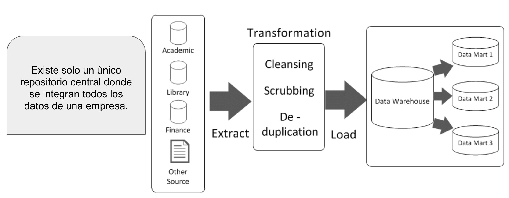

## Datos para la toma de decisiones

Las organizaciones modernas generan grandes volúmenes de datos diariamente: ventas, transacciones financieras, registros académicos, consultas médicas, interacciones digitales, entre otros.

Sin embargo, operar el negocio no es lo mismo que analizarlo. Los sistemas operacionales están diseñados para registrar transacciones de manera eficiente, pero no para responder preguntas estratégicas.

Por ejemplo:

- Un sistema de ventas permite registrar compras.
- Pero responder preguntas como:
  - ¿Qué producto se vende más en el último año?
  - ¿Cómo han evolucionado las ventas en los últimos cinco años?
  - ¿Qué sucursal tiene mejor desempeño?

requiere una estructura distinta, optimizada para análisis histórico, agregación y comparación temporal.

En este contexto, resulta fundamental comprender que el análisis de datos no comienza directamente con la tecnología, sino con la definición clara del problema de negocio. Una de las metodologías más utilizadas para estructurar este proceso es **CRISP-DM** (*Cross Industry Standard Process for Data Mining*).

CRISP-DM propone un marco sistemático compuesto por seis fases:

1. **Comprensión del negocio**: identificar los objetivos estratégicos y traducirlos en preguntas analíticas concretas.  
2. **Comprensión de los datos**: explorar las fuentes disponibles, evaluar calidad y detectar posibles inconsistencias.  
3. **Preparación de los datos**: limpiar, transformar e integrar la información.  
4. **Modelado**: aplicar técnicas analíticas o modelos estadísticos.  
5. **Evaluación**: verificar si los resultados responden adecuadamente a los objetivos iniciales.  
6. **Despliegue**: implementar los hallazgos en la operación o en sistemas de soporte a decisiones.  

{width=60%}

*Figura 1. Diagrama del proceso CRISP-DM. Fuente: Wikimedia Commons, “CRISP-DM Process Diagram”, dominio público.*


Es importante destacar que CRISP-DM **no es un proceso lineal**, sino un modelo iterativo. En la práctica, las fases se retroalimentan constantemente. Durante el modelado pueden detectarse problemas en la calidad de los datos que obliguen a regresar a la fase de preparación. En la evaluación puede descubrirse que el problema de negocio fue formulado de manera incompleta, lo que implica volver a la primera fase. Incluso después del despliegue, los resultados obtenidos suelen generar nuevas preguntas estratégicas, reiniciando el ciclo.

Esta naturaleza iterativa es coherente con la realidad organizacional: la toma de decisiones es un proceso continuo de refinamiento y aprendizaje. Así, antes de construir tablas, definir dimensiones o elegir herramientas tecnológicas, es necesario responder preguntas como:

- ¿Qué decisiones desea mejorar la organización?  
- ¿Qué métricas son críticas?  
- ¿Qué horizonte temporal se requiere analizar?  

La arquitectura de datos debe ser flexible y escalable, permitiendo incorporar nuevas fuentes, nuevas métricas y nuevas dimensiones conforme evolucionan las necesidades del negocio. En otras palabras, la arquitectura de datos no es un fin en sí mismo; es el soporte técnico que permite convertir datos operacionales en conocimiento útil dentro de un ciclo continuo de mejora y toma de decisiones.


## Data Warehouse

William H. Inmon (1996) define un Data Warehouse como:

> “A data warehouse is a subject-oriented, integrated, time-variant, and non-volatile collection of data in support of management’s decision-making process.”

En español, un Almacén de Datos es una colección de datos orientada a temas, integrada, variante en el tiempo y no volátil, diseñada para apoyar la toma de decisiones.

Un Data Warehouse es **orientado a temas**, lo que significa que no se organiza por aplicaciones o sistemas operacionales, sino por entidades relevantes para el negocio. Por ejemplo, en una compañía de seguros, el almacén de datos se estructura alrededor de conceptos como cliente, póliza o prima, y no por productos específicos como seguro de automóvil o seguro de vida. El enfoque está en analizar entidades del negocio y no módulos técnicos.

Es también **variante en el tiempo**, ya que mantiene información histórica. Los datos no se sobreescriben ni se actualizan como en un sistema transaccional; la nueva información se agrega al repositorio. Esto permite analizar tendencias a lo largo de cinco, diez años o más, y responder preguntas como cómo ha evolucionado el número de diagnósticos en los últimos años o qué patrones se observan en el crecimiento de ventas.

Además, es **integrado**, porque consolida información proveniente de múltiples sistemas. Por ejemplo, si un sistema registra el género como "m" y "f" y otro como 0 y 1, antes de integrarlos deben transformarse para mantener consistencia. Lo mismo ocurre con formatos de fecha distintos, monedas diferentes o nombres de productos inconsistentes. La integración implica procesos de limpieza, transformación y estandarización de datos.

Finalmente, es **no volátil**, lo que significa que se trata de un repositorio físicamente separado de los sistemas operacionales. En él se realizan principalmente operaciones de carga y consulta de datos, pero no actualizaciones frecuentes, eliminaciones ni transacciones. Su propósito es analítico y no operativo.

**Referencia:**  
Inmon, W. H. *Building the Data Warehouse*, 2nd ed., 1996.

# Arquitectura de un Data Warehouse

Un Data Warehouse no debe entenderse únicamente como un conjunto de tablas organizadas para consulta. En realidad, es una arquitectura integral de datos cuyo propósito es separar claramente la operación diaria del análisis estratégico. Esta arquitectura permite integrar información proveniente de múltiples sistemas, conservar historia y ofrecer estructuras optimizadas para la toma de decisiones.

## Modelo de 3 Capas
La arquitectura clásica de un Data Warehouse suele representarse mediante un modelo de tres capas lógicas. Estas capas no necesariamente corresponden a servidores físicos distintos, sino a niveles funcionales dentro del ecosistema de datos.


1. **Capa de fuentes (Operational Layer).**  
   En este nivel residen los sistemas que soportan la actividad diaria de la organización. En una empresa pueden incluirse sistemas ERP que registran ventas y facturación, CRM que gestionan clientes, plataformas académicas que almacenan calificaciones o sistemas hospitalarios que documentan consultas médicas. También forman parte de esta capa archivos planos como CSV o Excel, APIs externas que proveen información pública y registros de aplicaciones (logs).

   El objetivo de esta capa es transaccional: registrar eventos de manera rápida, consistente y segura. No está diseñada para análisis histórico profundo ni para responder preguntas agregadas complejas. Por ejemplo, un sistema hospitalario puede indicar cuántos pacientes están siendo atendidos hoy, pero no está optimizado para analizar la evolución de diagnósticos durante los últimos diez años.

2. **Capa de integración (ETL / Data Integration Layer).**  
   Esta capa constituye el núcleo técnico del Data Warehouse. En ella se ejecutan los procesos de extracción, limpieza, transformación e integración de datos. Es aquí donde se resuelven inconsistencias entre sistemas: un género registrado como "M/F" en un sistema y como "0/1" en otro debe unificarse; formatos de fecha distintos deben homogenizarse; monedas diferentes deben convertirse a un estándar común.

   Asimismo, se eliminan duplicados, se generan claves sustitutas y se aplican reglas de negocio que permiten consolidar información proveniente de múltiples fuentes. Dependiendo del enfoque arquitectónico adoptado, esta capa puede materializarse como un **Enterprise Data Warehouse (EDW)** central integrado, en el que se consolida toda la información corporativa antes de exponerla a los usuarios, o bien puede consistir en procesos que alimentan directamente modelos dimensionales específicos para cada área del negocio. En cualquier caso, su función es garantizar coherencia, calidad e integración de datos a nivel empresarial.

3. **Capa de consumo (Presentation / Analytics Layer).**  
   En este nivel los datos ya han sido integrados y estructurados para facilitar el análisis. Aquí se implementan data marts, modelos dimensionales (como esquemas estrella), tableros de Business Intelligence y herramientas de visualización. Es el punto donde analistas, directivos y responsables de negocio interactúan con la información para responder preguntas estratégicas.

   Por ejemplo, en un grupo de clínicas esta capa permitiría consultar la evolución anual de pacientes por clínica, el tiempo promedio de espera por especialidad o la distribución de diagnósticos por región. La característica esencial es que los datos están optimizados para consulta, agregación y comparación temporal, no para registrar nuevas transacciones.

## Data Mart

Un **Data Mart** es un subconjunto especializado del Data Warehouse orientado a un área específica del negocio. Mientras que el Data Warehouse integra información a nivel corporativo, el Data Mart concentra datos relevantes para un dominio particular, como ventas, finanzas, recursos humanos o trayectoria académica.

{#fig-datamart fig-cap="Data Marts dentro de la arquitectura de un Data Warehouse. Fuente: Troyanx, 'Data Mart', https://troyanx.com/Hefesto/data-mart.html" width=70% fig-align="center"}

Por ejemplo, en una universidad puede existir un Data Mart académico que almacene hechos relacionados con inscripciones, calificaciones y créditos, junto con dimensiones como estudiante, asignatura y tiempo. En una empresa comercial, un Data Mart de ventas podría contener hechos de transacciones y dimensiones como producto, cliente y región.

El objetivo principal de un Data Mart es facilitar el análisis focalizado y mejorar el rendimiento de consultas dentro de un área concreta. Generalmente se implementa utilizando modelado multidimensional (por ejemplo, esquemas estrella), ya que este formato está optimizado para agregaciones y reportes.

Dependiendo de la estrategia arquitectónica adoptada, los Data Marts pueden construirse como derivaciones de un Data Warehouse central (enfoque top-down) o desarrollarse inicialmente por proceso de negocio e integrarse posteriormente mediante dimensiones compartidas (enfoque bottom-up).

## Data Warehouse vs Data Lake

En el contexto actual de gestión de datos, es importante mencionar brevemente el concepto de **Data Lake**, ya que suele confundirse con un Data Warehouse.

Un Data Lake es un repositorio centralizado que almacena datos en su formato original, ya sean estructurados, semiestructurados o no estructurados. A diferencia del Data Warehouse, que requiere procesos de limpieza e integración antes de almacenar la información, el Data Lake adopta un enfoque más flexible: primero almacena los datos y posteriormente los transforma cuando se necesitan para análisis.

Por ejemplo, un Data Warehouse almacenará ventas consolidadas y normalizadas listas para consulta. En cambio, un Data Lake puede almacenar registros crudos de sensores, imágenes médicas, archivos JSON, logs de aplicaciones o grandes volúmenes de texto sin procesar.

La diferencia clave radica en su propósito:

- El **Data Warehouse** está diseñado para análisis estructurado y toma de decisiones empresariales.
- El **Data Lake** está orientado al almacenamiento masivo y flexible de datos, especialmente útil en escenarios de Big Data y ciencia de datos.

En arquitecturas modernas, ambos pueden coexistir. El Data Lake actúa como repositorio de datos crudos, mientras que el Data Warehouse ofrece estructuras optimizadas para análisis empresarial.

# Enfoques de implementación: Kimball vs Inmon

Existen dos enfoques clásicos para construir un DW completo: Kimball y Inmon. Ambos aparecen como referencias bibliográficas en el material del curso (Kimball para modelado dimensional e Inmon para arquitectura de DW) :contentReference[oaicite:19]{index=19}.

## Enfoque Kimball (bottom-up, bus architecture)

El enfoque Kimball prioriza entregar valor temprano mediante data marts dimensionales (usualmente en estrella) construidos por procesos de negocio. La idea central es que distintos data marts se integren a través de dimensiones conformadas (conformed dimensions), es decir, dimensiones compartidas y coherentes (por ejemplo, la misma definición de “Tiempo” y “Producto” para ventas y devoluciones).

{#fig-kimball width=90% fig-align="center"}

Rasgos característicos:

- Implementación incremental: se construye un data mart (p. ej., Ventas) y se amplía gradualmente (p. ej., Inventario, Marketing).
- Modelo objetivo: dimensional, orientado a consulta.
- Énfasis en la capa semántica: definiciones de métricas consistentes (por ejemplo, qué significa “venta neta”).
- Alta utilidad para BI/analítica desde etapas tempranas.

Ventajas:

- Entrega rápida de resultados a usuarios.
- Consultas simples y rendimiento alto.
- Ajuste natural a preguntas de negocio, que es el punto de partida recomendado en el curso :contentReference[oaicite:20]{index=20}.

Riesgos o retos:

- Requiere disciplina fuerte para definir dimensiones conformadas; si no, se terminan construyendo “silos” (varios data marts incompatibles).
- El gobierno de datos y la integración pueden volverse complejos si se crece sin estándares.

## Enfoque Inmon (top-down, EDW primero)

El enfoque Inmon propone construir primero un Enterprise Data Warehouse (EDW) central e integrado (frecuentemente en un modelo más normalizado), y después derivar data marts o estructuras dimensionales para consumo analítico.

{#fig-inmon width=90% fig-align="center"}

Rasgos característicos:

- La integración empresarial es prioritaria: definiciones corporativas únicas desde el inicio.
- Se enfatiza un “repositorio central” donde se armonizan entidades y reglas (cliente, producto, organización).
- Los data marts o modelos dimensionales se construyen a partir del EDW, como vistas o capas derivadas.

Ventajas:

- Alta consistencia y control de definiciones a nivel corporativo.
- Favorece gobierno de datos, auditoría, linaje y estándares.

Riesgos o retos:

- Mayor tiempo hasta generar valor visible si el EDW se vuelve un proyecto grande.
- Es más sensible a cambios de requerimientos porque “primero se integra todo” y luego se habilitan casos de uso.

## Cómo elegir adecuadamente entre Kimball e Inmon

La elección no debería plantearse como “cuál es mejor”, sino “cuál es más adecuado” al contexto institucional, al horizonte de tiempo y a la madurez del gobierno de datos. Criterios prácticos:

1. Urgencia de valor analítico y recursos disponibles  
   - Si se necesita entregar reportes y tableros funcionales rápidamente, y el equipo es pequeño/mediano, Kimball suele ser más viable: se construye un primer data mart y se itera.
   - Si la organización puede sostener una inversión inicial grande y su prioridad es consolidar definiciones corporativas desde el inicio, Inmon puede ser más apropiado.

2. Grado de heterogeneidad y fragmentación de fuentes  
   - Cuando existen muchas fuentes dispares y hay conflictos fuertes de definición (por ejemplo, “cliente activo” significa cosas distintas en áreas distintas), un enfoque tipo Inmon ayuda a forzar una integración central.
   - Si las fuentes son manejables y el problema principal es acelerar el análisis por proceso de negocio (ventas, trayectoria académica, atención médica), Kimball suele funcionar bien.

3. Gobierno de datos, auditoría y trazabilidad  
   - Si hay requerimientos estrictos de auditoría, linaje, cumplimiento o trazabilidad (por ejemplo, regulaciones y auditorías frecuentes), el enfoque top-down facilita un marco centralizado.
   - Si el gobierno de datos aún está en formación, un enfoque incremental puede ser más realista, siempre y cuando se establezcan estándares mínimos (dimensiones conformadas, glosario de métricas, versionado de reglas).

4. Naturaleza de los casos de uso  
   - Casos muy orientados a métricas agregadas y navegación dimensional (tendencias por tiempo, comparativos por región, cohortes) se benefician de dimensionalidad desde el inicio, favoreciendo Kimball.
   - Casos de integración empresarial transversal (master data robusto, conciliación entre sistemas, integración de dominios complejos) favorecen Inmon o, al menos, una capa central fuerte.

En la práctica moderna es común un enfoque híbrido: se puede construir una capa integrada (tipo EDW o “core”) y, en paralelo o después, exponer modelos dimensionales para BI. El punto esencial es mantener coherencia: definir claramente qué capa es “fuente de verdad” para definiciones y cómo se publican métricas y dimensiones para consumo analítico.

<!-- ## Conclusión
A nivel de implementación global, los enfoques Kimball e Inmon ofrecen estrategias diferentes para construir un DW: uno incremental y dimensional desde el inicio; el otro integrado y centralizado antes de derivar estructuras de consumo. La elección depende del contexto organizacional, los objetivos y la madurez de gobierno de datos, manteniendo siempre el principio rector del curso: diseñar a partir de las decisiones que se desean soportar, no a partir de la herramienta.  -->


<!-- # Ejemplo práctico: Grupo de clínicas

Supongamos que un grupo de clínicas desea responder preguntas como: ¿qué clínica atiende más pacientes al año?, ¿cómo han evolucionado los diagnósticos en los últimos cinco años?, ¿cuál presenta mayor tiempo promedio de espera?

Intentar responder estas preguntas directamente desde los sistemas operacionales implicaría consultas complejas que podrían afectar el rendimiento de los sistemas médicos en tiempo real. Además, sería difícil integrar información histórica consolidada.

Con una arquitectura de tres capas, cada clínica alimenta la capa de integración; allí se consolidan y estandarizan los datos. Posteriormente, en la capa de consumo, se implementa un modelo analítico que permite responder estas preguntas de manera eficiente, sin afectar la operación diaria. -->


# Ejemplo práctico: Facultad de Ciencias

En un contexto universitario, el sistema de calificaciones registra eventos puntuales como la inscripción de un estudiante en una asignatura o la obtención de una nota al finalizar el semestre. Sin embargo, analizar la trayectoria académica completa de un estudiante requiere una visión mucho más amplia: integrar múltiples periodos, generaciones, asignaturas, planes de estudio y, en muchos casos, información administrativa y financiera asociada.

Los sistemas operacionales académicos están diseñados para soportar procesos diarios —inscripciones, captura de calificaciones, emisión de constancias— pero no para realizar análisis longitudinales o comparativos complejos. Por ejemplo, responder preguntas como:

- ¿Cómo ha evolucionado el desempeño promedio por generación en los últimos diez años?
- ¿Qué cohortes presentan mayores tasas de abandono?
- ¿Existe relación entre modalidad de ingreso y desempeño académico?

implica integrar información dispersa en distintos sistemas y conservar historia de manera estructurada.

Un **Data Warehouse académico** permite consolidar esta información en un repositorio histórico, integrado y consistente, diseñado específicamente para análisis estratégico.

## Fuentes de datos

En una Facultad de Ciencias, la información relevante para análisis institucional suele encontrarse distribuida en múltiples sistemas independientes. Entre ellos pueden incluirse:

- Sistemas de control escolar que registran inscripciones, calificaciones y créditos.
- Sistemas de admisiones que almacenan información de ingreso, generación y antecedentes académicos.
- Sistemas administrativos y financieros que gestionan pagos, becas y apoyos.
- Sistemas de recursos humanos con información sobre profesores y carga docente.
- Archivos externos como encuestas institucionales o evaluaciones académicas.

Cada uno de estos sistemas cumple una función operativa específica. Sin embargo, ninguno por sí mismo ofrece una visión integral del desempeño académico institucional a lo largo del tiempo. La fragmentación de fuentes dificulta el análisis global y puede generar inconsistencias en métricas y definiciones.

## Procesos de integración (ETL)

Para transformar datos operacionales en información estratégica es necesario un proceso de integración sistemático.

En esta etapa se extrae periódicamente la información de los distintos sistemas, se validan y corrigen inconsistencias, se homologan formatos y se consolidan registros que pertenecen a la misma entidad institucional. Por ejemplo, un estudiante puede aparecer con variaciones en su nombre entre sistemas distintos; el proceso de integración debe identificar que se trata de la misma persona y unificar su información.

Asimismo, se normalizan conceptos institucionales: nombres de carreras, códigos de asignatura, periodos académicos y categorías administrativas deben definirse de manera coherente para todo el repositorio.

El resultado de estos procesos no es simplemente una copia de los sistemas originales, sino un conjunto de datos consolidados, limpios y preparados para análisis histórico.


## Consolidación en el Data Warehouse

Una vez integrados, los datos se almacenan en un repositorio central que conserva información histórica y garantiza consistencia institucional. Este repositorio no está orientado a registrar nuevas transacciones, sino a permitir consultas analíticas eficientes y comparaciones longitudinales.

Desde el punto de vista arquitectónico, el Data Warehouse académico se convierte en la base para construir vistas analíticas especializadas —como un data mart académico— desde donde pueden generarse reportes, tableros y estudios institucionales.

Gracias a esta consolidación, la Facultad puede:

- Analizar cohortes completas desde ingreso hasta egreso.
- Medir tasas de reprobación y abandono por generación.
- Identificar asignaturas críticas.
- Evaluar tendencias de desempeño a lo largo del tiempo.
- Integrar indicadores académicos con variables administrativas o financieras.

La diferencia fundamental respecto a los sistemas transaccionales es que el Data Warehouse ofrece una visión histórica, integrada y consistente del desempeño institucional, permitiendo transformar datos operacionales en conocimiento estratégico.

El diseño específico de las estructuras analíticas —como modelos dimensionales, tablas de hechos y dimensiones— se abordará en el siguiente capítulo, donde se detallará cómo se organizan técnicamente estos datos para optimizar su consulta.

## Diagrama arquitectónico del DW académico

```{mermaid}
flowchart TB

    %% ----- Subgrafos -----
    subgraph Fuentes
        A1[Sistema Control Escolar]
        A2[Sistema Admisiones]
        A3[Sistema Financiero]
        A4[Sistema Recursos Humanos]
        A5[Encuestas / Archivos CSV]
    end

    subgraph ETL
        B1[Extracción]
        B2[Limpieza]
        B3[Transformación]
        B4[Integración]
    end

    subgraph DW["Data Warehouse Académico"]
        C1[(Tabla Hecho Evaluación)]
        C2[(Dimensión Estudiante)]
        C3[(Dimensión Asignatura)]
        C4[(Dimensión Tiempo)]
        C5[(Dimensión Profesor)]
    end

    subgraph Analítica
        D1[Data Mart Académico]
        D2[Dashboard de Desempeño]
        D3[Análisis de Cohortes]
        D4[Reporte de Abandono]
    end

    %% ----- Flujo -----
    A1 --> B1
    A2 --> B1
    A3 --> B1
    A4 --> B1
    A5 --> B1

    B1 --> B2 --> B3 --> B4

    B4 --> C1
    B4 --> C2
    B4 --> C3
    B4 --> C4
    B4 --> C5

    C1 --> D1
    D1 --> D2
    D1 --> D3
    D1 --> D4

    %% ----- Estilos personalizados -----
    classDef fuentes fill:#e8f0fe,stroke:#2b5dab,stroke-width:1px,color:#000;
    classDef etl fill:#fff3e0,stroke:#e65100,stroke-width:1px,color:#000;
    classDef dw fill:#e8f5e9,stroke:#1b5e20,stroke-width:1px,color:#000;
    classDef analitica fill:#f3e5f5,stroke:#6a1b9a,stroke-width:1px,color:#000;

    class A1,A2,A3,A4,A5 fuentes;
    class B1,B2,B3,B4 etl;
    class C1,C2,C3,C4,C5 dw;
    class D1,D2,D3,D4 analitica;
```

Con esta arquitectura, la Facultad podría analizar cohortes completas desde el ingreso hasta el egreso, medir las tasas de abandono por generación, detectar asignaturas críticas con alta reprobación, evaluar el impacto de las becas en el desempeño académico e identificar patrones longitudinales de rendimiento. A diferencia del sistema transaccional, el Data Warehouse integra información que se encuentra dispersa en distintos sistemas, conserva el historial de los datos a lo largo del tiempo, permite realizar análisis multidimensionales y está optimizado para procesos de agregación y consulta. En este contexto, el Data Warehouse no reemplaza los sistemas académicos, sino que los complementa, transformando los datos operacionales en información estratégica que apoya la toma de decisiones institucionales.

# Conclusión

Un Data Warehouse no sustituye a los sistemas operacionales ni registra transacciones cotidianas. Su función es integrar información dispersa, conservar historia, romper silos organizacionales y facilitar análisis complejos orientados a la toma de decisiones estratégicas.

En la siguiente sección se abordará el modelado multidimensional, que define cómo se estructuran las tablas analíticas dentro de esta arquitectura y cómo se optimizan para consultas agregadas.
<!-- ---
title: "Introducción a los Almacenes de Datos"
format: html
---

## Datos para la toma de decisiones

Las organizaciones modernas generan grandes volúmenes de datos diariamente: ventas, transacciones financieras, registros académicos, consultas médicas, interacciones digitales, entre otros.

Sin embargo, operar el negocio no es lo mismo que analizarlo.  
Los sistemas operacionales están diseñados para registrar transacciones de manera eficiente, pero no para responder preguntas estratégicas.

Por ejemplo:
- Un sistema de ventas permite registrar compras.
- Pero responder preguntas como:
  - ¿Qué producto se vende más en el último año?
  - ¿Cómo han evolucionado las ventas en los últimos cinco años?
  - ¿Qué sucursal tiene mejor desempeño?

requiere una estructura distinta, optimizada para análisis.

---

## Data Warehouse

William H. Inmon (1996) define un Data Warehouse como:

> “A data warehouse is a subject-oriented, integrated, time-variant, and non-volatile collection of data in support of management’s decision-making process.”

En español, un Almacén de Datos es una colección de datos orientada a temas, integrada, variante en el tiempo y no volátil, diseñada para apoyar la toma de decisiones.

Un Data Warehouse es **orientado a temas**, lo que significa que no se organiza por aplicaciones o sistemas operacionales, sino por entidades relevantes para el negocio. Por ejemplo, en una compañía de seguros, el almacén de datos se estructura alrededor de conceptos como cliente, póliza o prima, y no por productos específicos como seguro de automóvil o seguro de vida. El enfoque está en analizar entidades del negocio y no módulos técnicos.

Es también **variante en el tiempo**, ya que mantiene información histórica. Los datos no se sobreescriben ni se actualizan como en un sistema transaccional; la nueva información se agrega al repositorio. Esto permite analizar tendencias a lo largo de cinco, diez años o más, y responder preguntas como cómo ha evolucionado el número de diagnósticos en los últimos años o qué patrones se observan en el crecimiento de ventas.

Además, es **integrado**, porque consolida información proveniente de múltiples sistemas. Por ejemplo, si un sistema registra el género como "m" y "f" y otro como 0 y 1, antes de integrarlos deben transformarse para mantener consistencia. Lo mismo ocurre con formatos de fecha distintos, monedas diferentes o nombres de productos inconsistentes. La integración implica procesos de limpieza, transformación y estandarización de datos.

Finalmente, es **no volátil**, lo que significa que se trata de un repositorio físicamente separado de los sistemas operacionales. En él se realizan principalmente operaciones de carga y consulta de datos, pero no actualizaciones frecuentes, eliminaciones ni transacciones. Su propósito es analítico y no operativo.

**Referencia:**  
Inmon, W. H. *Building the Data Warehouse*, 2nd ed., 1996.
---

# Arquitectura básica de un Data Warehouse

La arquitectura típica de un Data Warehouse se basa en la interconexión de varios componentes con el fin de ofrecer la capacidad técnica para responder a consultas analíticas complejas. Estos componentes incluyen:

1. Fuentes de datos crudos (raw data): 
Un almacen de datos robusto colecciona información de diversas fuentes, desde datos estructurados de bases de datos o no estrucurados como textos o logs. Algunos ejemplos incluyen:
   - Bases de datos operacionales (ERP, CRM)
   - Archivos planos (CSV, Excel)
   - Fuentes externas (redes sociales, datos públicos, API's)
2. Procesos de:
   - Limpieza
   - Transformación
   - Integración
   - Carga (ETL)
3. Un Data Warehouse central.
4. Usuarios que realizan consultas analíticas.

En el ejemplo de un grupo de clínicas:

- Cada clínica mantiene su propia base de datos.
- Los datos se limpian y transforman.
- Se cargan en un Data Warehouse central.
- Los analistas consultan el DW para responder preguntas estratégicas.

Esta arquitectura separa claramente la operación diaria del análisis estratégico. 

---

# Ejemplo práctico: Grupo de clínicas

Supongamos que se desea responder las siguientes preguntas:

1. ¿Cuál es la clínica con mayor número de pacientes al año?
2. ¿Cómo ha evolucionado el número de diagnósticos en los últimos cinco años?
3. ¿Qué clínica tiene mayor tiempo promedio de espera?
4. ¿Cuántos pacientes han sido atendidos en la clínica de San Diego?

Aunque estas preguntas podrían responderse directamente desde las bases operacionales, hacerlo:

- Sería complejo
- Podría afectar el rendimiento del sistema
- No estaría optimizado para análisis histórico

Un Data Warehouse está diseñado específicamente para este tipo de consultas.

---

# Caso académico: Facultad de Ciencias

Escenario:

La Facultad de Ciencias desea analizar la evolución académica de los estudiantes.

Pregunta central:

¿Es suficiente el sistema de calificaciones para analizar toda la trayectoria académica?

Probablemente no.

Porque:

- Solo registra eventos puntuales.
- No integra información histórica completa.
- No está optimizado para análisis longitudinal.
- No necesariamente integra información de otras áreas.

Un Data Warehouse permitiría:

- Analizar la trayectoria desde el ingreso hasta el egreso.
- Identificar patrones de abandono.
- Evaluar tendencias de desempeño.
- Integrar información académica con otros indicadores institucionales.

---

# Conclusión

Un Data Warehouse:

- No reemplaza los sistemas operacionales.
- No elimina los datos originales.
- No está diseñado para registrar transacciones.

Está diseñado para:

- Integrar información
- Conservar historia
- Facilitar análisis
- Apoyar decisiones estratégicas

En las siguientes sesiones se abordará el modelo multidimensional y el diseño de esquemas analíticos como el esquema estrella.


## Enfoques de implementación: Kimball vs Inmon

La elección de un esquema estrella o snowflake es una decisión de modelado dentro de una implementación. A un nivel más alto, existen dos enfoques clásicos para construir un DW completo: Kimball y Inmon. Ambos aparecen como referencias bibliográficas en el material del curso (Kimball para modelado dimensional e Inmon para arquitectura de DW) :contentReference[oaicite:19]{index=19}.

### Enfoque Kimball (bottom-up, bus architecture)

El enfoque Kimball prioriza entregar valor temprano mediante data marts dimensionales (usualmente en estrella) construidos por procesos de negocio. La idea central es que distintos data marts se integren a través de dimensiones conformadas (conformed dimensions), es decir, dimensiones compartidas y coherentes (por ejemplo, la misma definición de “Tiempo” y “Producto” para ventas y devoluciones).

Rasgos característicos:

- Implementación incremental: se construye un data mart (p. ej., Ventas) y se amplía gradualmente (p. ej., Inventario, Marketing).
- Modelo objetivo: dimensional, orientado a consulta.
- Énfasis en la capa semántica: definiciones de métricas consistentes (por ejemplo, qué significa “venta neta”).
- Alta utilidad para BI/analítica desde etapas tempranas.

Ventajas:

- Entrega rápida de resultados a usuarios.
- Consultas simples y rendimiento alto.
- Ajuste natural a preguntas de negocio, que es el punto de partida recomendado en el curso :contentReference[oaicite:20]{index=20}.

Riesgos o retos:

- Requiere disciplina fuerte para definir dimensiones conformadas; si no, se terminan construyendo “silos” (varios data marts incompatibles).
- El gobierno de datos y la integración pueden volverse complejos si se crece sin estándares.

### Enfoque Inmon (top-down, EDW primero)

El enfoque Inmon propone construir primero un Enterprise Data Warehouse (EDW) central e integrado (frecuentemente en un modelo más normalizado), y después derivar data marts o estructuras dimensionales para consumo analítico.

Rasgos característicos:

- La integración empresarial es prioritaria: definiciones corporativas únicas desde el inicio.
- Se enfatiza un “repositorio central” donde se armonizan entidades y reglas (cliente, producto, organización).
- Los data marts o modelos dimensionales se construyen a partir del EDW, como vistas o capas derivadas.

Ventajas:

- Alta consistencia y control de definiciones a nivel corporativo.
- Favorece gobierno de datos, auditoría, linaje y estándares.

Riesgos o retos:

- Mayor tiempo hasta generar valor visible si el EDW se vuelve un proyecto grande.
- Es más sensible a cambios de requerimientos porque “primero se integra todo” y luego se habilitan casos de uso.

### Cómo elegir adecuadamente entre Kimball e Inmon

La elección no debería plantearse como “cuál es mejor”, sino “cuál es más adecuado” al contexto institucional, al horizonte de tiempo y a la madurez del gobierno de datos. Criterios prácticos:

1. Urgencia de valor analítico y recursos disponibles  
   - Si se necesita entregar reportes y tableros funcionales rápidamente, y el equipo es pequeño/mediano, Kimball suele ser más viable: se construye un primer data mart y se itera.
   - Si la organización puede sostener una inversión inicial grande y su prioridad es consolidar definiciones corporativas desde el inicio, Inmon puede ser más apropiado.

2. Grado de heterogeneidad y fragmentación de fuentes  
   - Cuando existen muchas fuentes dispares y hay conflictos fuertes de definición (por ejemplo, “cliente activo” significa cosas distintas en áreas distintas), un enfoque tipo Inmon ayuda a forzar una integración central.
   - Si las fuentes son manejables y el problema principal es acelerar el análisis por proceso de negocio (ventas, trayectoria académica, atención médica), Kimball suele funcionar bien.

3. Gobierno de datos, auditoría y trazabilidad  
   - Si hay requerimientos estrictos de auditoría, linaje, cumplimiento o trazabilidad (por ejemplo, regulaciones y auditorías frecuentes), el enfoque top-down facilita un marco centralizado.
   - Si el gobierno de datos aún está en formación, un enfoque incremental puede ser más realista, siempre y cuando se establezcan estándares mínimos (dimensiones conformadas, glosario de métricas, versionado de reglas).

4. Naturaleza de los casos de uso  
   - Casos muy orientados a métricas agregadas y navegación dimensional (tendencias por tiempo, comparativos por región, cohortes) se benefician de dimensionalidad desde el inicio, favoreciendo Kimball.
   - Casos de integración empresarial transversal (master data robusto, conciliación entre sistemas, integración de dominios complejos) favorecen Inmon o, al menos, una capa central fuerte.

En la práctica moderna es común un enfoque híbrido: se puede construir una capa integrada (tipo EDW o “core”) y, en paralelo o después, exponer modelos dimensionales para BI. El punto esencial es mantener coherencia: definir claramente qué capa es “fuente de verdad” para definiciones y cómo se publican métricas y dimensiones para consumo analítico.

## Conclusión
A nivel de implementación global, los enfoques Kimball e Inmon ofrecen estrategias diferentes para construir un DW: uno incremental y dimensional desde el inicio; el otro integrado y centralizado antes de derivar estructuras de consumo. La elección depende del contexto organizacional, los objetivos y la madurez de gobierno de datos, manteniendo siempre el principio rector del curso: diseñar a partir de las decisiones que se desean soportar, no a partir de la herramienta. -->