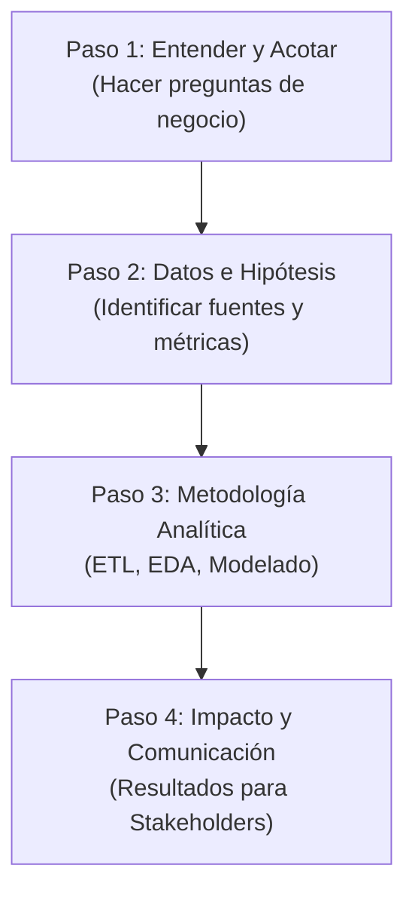

# Preparación para Entrevistas Analíticas

## 1. La Importancia del Proceso de Pensamiento

En el reclutamiento para roles de analítica, minería e ingeniería de datos, las pruebas técnicas y las entrevistas ya no se limitan a evaluar si recuerdas la sintaxis exacta de una consulta SQL o los parámetros de un clasificador en Scikit-Learn. Los entrevistadores buscan comprender **cómo piensas y resuelves problemas complejos**.

Demostrar tu proceso de pensamiento de forma estructurada le indica al empleador que:
*   Puedes lidiar con la ambigüedad (problemas de negocio mal definidos).
*   No saltas a conclusiones sin explorar hipótesis.
*   Priorizas el valor de negocio antes que la complejidad del algoritmo.
*   Eres capaz de comunicar conceptos complejos a stakeholders no técnicos.

---

## 2. El Marco de Resolución de Problemas en 4 Pasos

Cuando te enfrentes a un caso de negocio o pregunta abierta en una entrevista técnica, evita dar una respuesta directa e inmediata. Utiliza el siguiente marco estructurado para guiar al entrevistador a través de tu solución:

### Paso 1: Entender y Acotar el Problema
*   **Qué hacer**: Haz preguntas aclaratorias para definir el alcance del problema. Nunca asumas.
*   **Frases útiles**: 
    *   *"Antes de estructurar la base de datos, ¿cuál es el objetivo principal de este análisis para el negocio?"*
    *   *"¿Estamos midiendo la tasa de retención de forma mensual o anual?"*

### Paso 2: Formular Hipótesis e Identificar Datos
*   **Qué hacer**: Propón las variables y fuentes de datos necesarias. Explica qué supuestos quieres validar.
*   **Frases útiles**:
    *   *"Mi hipótesis es que los clientes que cancelan su servicio tienen una baja frecuencia de inicio de sesión en los últimos 15 días. Para validar esto, necesitaría acceder a los logs de actividad del usuario y a la tabla de suscripciones."*

### Paso 3: Definir la Metodología Analítica
*   **Qué hacer**: Explica paso a paso cómo procesarás y modelarás la información (desde la ingesta hasta la validación del modelo).
*   **Frases útiles**:
    *   *"Primero realizaría una limpieza para tratar los valores nulos en el historial. Luego, aplicaría un análisis exploratorio (EDA) para visualizar correlaciones. Si el objetivo es predictivo, entrenaría un XGBoost y evaluaría su desempeño utilizando la métrica Recall, porque en este caso los falsos negativos son muy costosos."*

### Paso 4: Traducir al Impacto de Negocio
*   **Qué hacer**: Concluye explicando cómo presentarías los resultados a un director de área o stakeholder clave.
*   **Frases útiles**:
    *   *"Finalmente, presentaría los resultados mediante un dashboard interactivo enfocado en el ahorro financiero estimado al retener al 10% de los clientes identificados en riesgo por el modelo."*

---

## 3. Preguntas de Práctica Comunes y Guías de Respuesta

### Caso 1: Diseñar un Pipeline de Ingesta
> **Pregunta del Entrevistador**: *"Nuestra aplicación móvil genera millones de eventos de clics por segundo y queremos analizarlos diariamente para ajustar ofertas. ¿Cómo diseñarías esta arquitectura?"*

*   **Enfoque de respuesta**:
    1.  Clasifica el procesamiento: Identifica que es un caso mixto (ingesta continua/streaming, análisis en lote/batch).
    2.  Propón herramientas del ecosistema en la nube: Sugiere un almacenamiento intermedio de bajo costo (ej. Google Cloud Storage) para almacenar el flujo continuo, y un motor de procesamiento distribuido (ej. PySpark en Databricks) para procesar los datos agregados cada noche.
    3.  Añade gobernanza: Menciona la necesidad de un catálogo de datos para indexar estos esquemas semi-estructurados (JSON).

### Caso 2: Selección de Métricas Analíticas
> **Pregunta del Entrevistador**: *"Tenemos un modelo para detectar fraudes en transacciones de e-commerce. La precisión general (Accuracy) es del 99%. ¿Deberíamos ponerlo en producción?"*

*   **Enfoque de respuesta**:
    1.  Desafía la métrica: Explica que en conjuntos de datos altamente desbalanceados (como el fraude, donde solo el 0.1% de las transacciones son fraudulentas), la precisión general es una métrica engañosa (un modelo que prediga 'No Fraude' para todo tendrá 99.9% de precisión).
    2.  Propón métricas alternativas: Sugiere usar **F1-Score**, **Precision** o **Recall** dependiendo del costo relativo de los Falsos Positivos (bloquear a un cliente legítimo) frente a los Falsos Negativos (dejar pasar un fraude).
