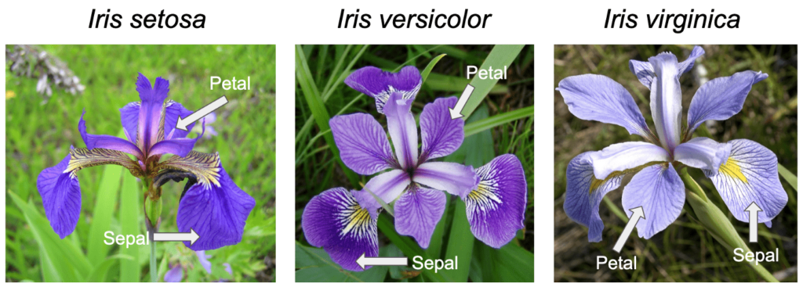

```{python}
#| include: false
import numpy as np
import pandas as pd
import plotly.graph_objects as go
import plotly.express as px
from plotly.subplots import make_subplots
from sklearn.preprocessing import StandardScaler
from sklearn.decomposition import PCA
from sklearn.datasets import load_iris, make_blobs
import warnings
warnings.filterwarnings('ignore')
```



Imagina dos sensores que registran casi el mismo movimiento. Si ambas lecturas suben y bajan juntas, dos columnas describen en gran parte una sola dirección. PCA gira los ejes para que el primero siga la mayor variación y el segundo recoja lo que queda. Las *puntuaciones*[^pca-scores] indican dónde queda cada observación sobre los nuevos ejes.

**Ejemplo mínimo.** Para las lecturas $(2,3)$, $(3,4)$ y $(4,5)$, al restar las medias $(3,4)$ obtenemos $(-1,-1)$, $(0,0)$ y $(1,1)$. Todos los puntos quedan sobre la diagonal: una sola coordenada basta para reconstruirlos. Más adelante calcularemos esa coordenada y la varianza que conserva.

::: {.callout-tip title="Antes de reducir dimensiones en un proyecto"}
Define para qué usarás los componentes: visualizar, comprimir o alimentar un modelo. Si vas a evaluar predicción, separa primero entrenamiento y prueba; aprende el escalado y PCA solo en entrenamiento y mide el resultado en datos no vistos. La varianza explicada resume variación de las entradas, no rendimiento predictivo.
:::

[^pca-scores]: **Puntuación (*score*)**: coordenada de una observación tras proyectarla sobre una componente principal. Los *loadings* son los pesos de las variables originales que definen esa dirección.

[^pca-eigen]: **Autovalor o eigenvalor**: número que indica cuánto estira una matriz una dirección propia. En PCA de la matriz de covarianza, equivale a la varianza capturada por la componente correspondiente.

[^pca-cov]: **Covarianza muestral**: $s_{jk}=\frac{1}{n-1}\sum_i (x_{ij}-\bar x_j)(x_{ik}-\bar x_k)$. Es positiva cuando dos variables tienden a estar por encima (o por debajo) de su media a la vez. Dividir entre $n-1$ en lugar de $n$ corrige el sesgo que produce usar la media muestral en vez de la media poblacional desconocida (corrección de Bessel); para las direcciones de PCA el divisor es irrelevante, porque solo reescala todos los autovalores.

[^pca-psd]: **Matriz semidefinida positiva**: matriz simétrica $S$ tal que $\mathbf{u}^T S\mathbf{u}\ge 0$ para todo vector $\mathbf{u}$. Para una covarianza, $\mathbf{u}^T S\mathbf{u}$ es la varianza de la combinación lineal $\tilde X\mathbf{u}$, y una varianza nunca es negativa. Por eso sus autovalores son reales y no negativos.

[^pca-lagrange]: **Multiplicadores de Lagrange**: técnica para optimizar una función sujeta a una restricción de igualdad. Se suma la restricción multiplicada por una incógnita $\lambda$ y se iguala a cero el gradiente respecto a todas las variables. En el óptimo, el gradiente del objetivo es paralelo al de la restricción.

## Ejemplo: dos sensores paso a paso

A continuación, calculamos el caso de los dos sensores de la intuición. Aquí **solo centramos**: ambas columnas tienen las mismas unidades y varianza. Así la matriz de covarianza y los autovalores de este ejemplo corresponden a los datos centrados; en el caso Iris posterior sí estandarizamos.

1.  **Definición de la matriz de datos original:**
    Supongamos $n=3$ observaciones (ej. mediciones de dos sensores) representados como filas y $p=2$ variables representadas como columnas:
    $$X = \begin{pmatrix} 2 & 3 \\ 3 & 4 \\ 4 & 5 \end{pmatrix}$$

2.  **Centrado de los datos:**
    Calculamos la media de cada columna: $\bar{x}_1 = 3$ y $\bar{x}_2 = 4$. Restamos la media a cada fila para obtener $\tilde{X}$:
    $$\tilde{X} = \begin{pmatrix} 2-3 & 3-4 \\ 3-3 & 4-4 \\ 4-3 & 5-4 \end{pmatrix} = \begin{pmatrix} -1 & -1 \\ 0 & 0 \\ 1 & 1 \end{pmatrix}$$

3.  **Cálculo de la matriz de covarianza[^pca-cov] ($S$):**
    Aplicamos $S = \frac{1}{n-1} \tilde{X}^T \tilde{X}$ con $n-1 = 2$:
    $$S = \frac{1}{2} \begin{pmatrix} -1 & 0 & 1 \\ -1 & 0 & 1 \end{pmatrix} \begin{pmatrix} -1 & -1 \\ 0 & 0 \\ 1 & 1 \end{pmatrix} = \frac{1}{2} \begin{pmatrix} 2 & 2 \\ 2 & 2 \end{pmatrix} = \begin{pmatrix} 1 & 1 \\ 1 & 1 \end{pmatrix}$$

4.  **Obtención de eigenvalores[^pca-eigen] ($\lambda$):**
    Resolvemos el determinante $\det(S - \lambda I) = 0$:
    $$\det \begin{pmatrix} 1-\lambda & 1 \\ 1 & 1-\lambda \end{pmatrix} = (1-\lambda)^2 - 1 = 0 \implies \lambda^2 - 2\lambda = 0$$
    Los resultados son **$\lambda_1 = 2$** y **$\lambda_2 = 0$**. La varianza total es $2+0=2$. El primer componente explica el $100\%$ de la varianza.

5.  **Obtención de eigenvectores ($\mathbf{v}$):**
    Para $\lambda_1 = 2$, resolvemos $(S - 2I)\mathbf{v}_1 = 0$:
    $$\begin{pmatrix} -1 & 1 \\ 1 & -1 \end{pmatrix} \begin{pmatrix} v_{11} \\ v_{21} \end{pmatrix} = 0 \implies v_{11} = v_{21}$$
    Normalizando para que $\|v\|=1$: **$v_1 = \begin{pmatrix} 1/\sqrt{2} \\ 1/\sqrt{2} \end{pmatrix} \approx \begin{pmatrix} 0.707 \\ 0.707 \end{pmatrix}$**.

6.  **Proyección de los datos ($k=1$):**
    Transformamos los datos centrados a la nueva dimensión $Z = \tilde{X} v_1$:
    $$Z = \begin{pmatrix} -1 & -1 \\ 0 & 0 \\ 1 & 1 \end{pmatrix} \begin{pmatrix} 0.707 \\ 0.707 \end{pmatrix} = \begin{pmatrix} -1.414 \\ 0 \\ 1.414 \end{pmatrix}$$

7.  **Conclusión:**
    Dado que los datos originales estaban perfectamente alineados ($x_2 = x_1 + 1$), el PCA ha logrado reducir la dimensionalidad de 2 a 1 sin ninguna pérdida de información, capturando toda la estructura de los datos en un solo eje.

### Laboratorio: reproduce los seis pasos y rompe la alineación

Las gráficas siguientes no son imágenes precalculadas: el navegador ejecuta una implementación de PCA para dos variables (centrado, covarianza, autovalores por la fórmula cuadrática, autovectores y proyección) cada vez que cambias los datos. Empieza con los tres puntos del ejemplo y recorre los pasos; comprueba que cada número coincide con el desarrollo anterior.

::: {.content-visible when-format="html"}
```{=html}
<div class="plab" id="pca-steps-lab">
  <p class="plab-eyebrow">Laboratorio 1 · PCA a mano, en el navegador</p>
  <h3 class="plab-title">Dos sensores, seis pasos</h3>
  <p class="plab-sub">Elige un paso. En las vistas de dispersión puedes <b>arrastrar los puntos</b>; los números y la gráfica se recalculan al instante.</p>
  <div class="plab-steps" role="group" aria-label="Pasos de PCA">
    <button type="button" data-step="1">1 · Datos</button>
    <button type="button" data-step="2">2 · Centrado</button>
    <button type="button" data-step="3">3 · Covarianza</button>
    <button type="button" data-step="4">4 · Autovalores</button>
    <button type="button" data-step="5">5 · Autovectores</button>
    <button type="button" data-step="6">6 · Proyección</button>
  </div>
  <div class="plab-grid wide-left">
    <div class="plab-panel">
      <svg id="pcaS-chart" role="img" aria-label="Gráfica del paso actual de PCA"></svg>
      <div class="plab-legend" id="pcaS-legend"></div>
      <div class="plab-controls" style="margin:.7rem 0 0">
        <button type="button" class="plab-btn" id="pcaS-noise">Perturbar puntos</button>
        <button type="button" class="plab-btn" id="pcaS-add">Agregar punto</button>
        <button type="button" class="plab-btn" id="pcaS-del">Quitar punto</button>
        <button type="button" class="plab-btn primary" id="pcaS-reset">Volver a (2,3), (3,4), (4,5)</button>
      </div>
    </div>
    <div class="plab-panel">
      <h4 id="pcaS-title"></h4>
      <p id="pcaS-explain" style="margin:0"></p>
      <div class="plab-math" id="pcaS-math"></div>
      <div class="plab-stats">
        <div class="plab-stat"><span>Observaciones n</span><strong id="pcaS-n"></strong></div>
        <div class="plab-stat"><span>λ₁ (varianza en PC1)</span><strong id="pcaS-l1"></strong></div>
        <div class="plab-stat"><span>λ₂ (varianza en PC2)</span><strong id="pcaS-l2"></strong></div>
        <div class="plab-stat"><span>Varianza explicada PC1</span><strong id="pcaS-pve"></strong></div>
      </div>
    </div>
  </div>
  <p class="plab-note" id="pcaS-note" aria-live="polite"></p>
</div>
<script>
(() => {
  const K = window.LabKit, root = document.getElementById('pca-steps-lab');
  const $ = s => root.querySelector(s);
  const START = [[2, 3], [3, 4], [4, 5]];
  const rand = K.rng(11);
  let pts = START.map(p => [...p]), step = 1, drag = null;

  // PCA para dos variables: forma cerrada de los autovalores de una matriz simétrica 2 × 2.
  function pca(P) {
    const n = P.length, mx = K.mean(P.map(p => p[0])), my = K.mean(P.map(p => p[1]));
    const C = P.map(p => [p[0] - mx, p[1] - my]);
    const a = K.sum(C.map(c => c[0] * c[0])) / (n - 1);
    const b = K.sum(C.map(c => c[0] * c[1])) / (n - 1);
    const d = K.sum(C.map(c => c[1] * c[1])) / (n - 1);
    const tr = a + d, det = a * d - b * b, disc = Math.sqrt(((a - d) / 2) ** 2 + b * b);
    const l1 = tr / 2 + disc, l2 = Math.max(tr / 2 - disc, 0);
    let v = Math.abs(b) > 1e-12 ? [b, l1 - a] : (a >= d ? [1, 0] : [0, 1]);
    const nv = Math.hypot(v[0], v[1]); v = v.map(x => x / nv);
    if (v[0] < -1e-12 || (Math.abs(v[0]) <= 1e-12 && v[1] < 0)) v = v.map(x => -x);
    const w = [-v[1], v[0]];
    const z = C.map(c => c[0] * v[0] + c[1] * v[1]);
    return { n, mean: [mx, my], C, S: [[a, b], [b, d]], tr, det, l: [l1, l2], v, w, z };
  }
  const clean = x => Math.abs(x) < 0.005 ? 0 : x;
  const f = (x, d = 2) => K.fmt(clean(x), d);
  function mat(name, M) {
    const cells = M.map(r => r.map(x => f(x)));
    const width = Math.max(...cells.flat().map(s => s.length));
    const pad = ' '.repeat(name.length + 3);
    return cells.map((r, i) => {
      const [l, rr] = M.length === 1 ? ['[', ']'] : i === 0 ? ['⎡', '⎤'] : i === M.length - 1 ? ['⎣', '⎦'] : ['⎢', '⎥'];
      const head = i === Math.floor((M.length - 1) / 2) ? `${name} = ` : pad;
      return `${head}${l} ${r.map(s => s.padStart(width)).join('  ')} ${rr}`;
    }).join('\n');
  }
  // Extremos de una recta por el origen con dirección u, recortada al cuadrado [-R, R]².
  const clip = (u, R) => { const t = R / Math.max(Math.abs(u[0]), Math.abs(u[1])); return [-t * u[0], -t * u[1], t * u[0], t * u[1]]; };
  const legend = items => { $('#pcaS-legend').innerHTML = items.map(([cls, lab, dot]) => `<span><i class="${dot ? 'dot' : ''}" style="background:var(--lab-${cls})"></i>${lab}</span>`).join(''); };

  function scatter(r, centered) {
    const R = centered ? Math.max(3.5, Math.ceil(Math.max(...r.C.flat().map(Math.abs)) * 1.2)) : 7;
    const dom = centered ? [-R, R] : [0, R];
    const c = K.chart($('#pcaS-chart'), { width: 400, height: 394, x: dom, y: dom, margin: { left: 44, right: 14, top: 14, bottom: 38 } });
    c.axes({ xTicks: 6, yTicks: 6, xLabel: centered ? 'x̃₁ (sensor A centrado)' : 'x₁ (sensor A)', yLabel: centered ? 'x̃₂ (sensor B centrado)' : 'x₂ (sensor B)' });
    if (centered) c.zeroLines();
    c.R = R; return c;
  }
  function drawPoints(c, P, cls = 's1') {
    P.forEach((p, i) => {
      const dot = c.dot(p[0], p[1], 7, `${cls} dot drag`); dot.dataset.i = i;
      c.text(p[0], p[1], `P${i + 1}`, { dx: 9, dy: -8, class: 'strong' });
    });
  }

  function render() {
    const r = pca(pts);
    root.querySelectorAll('.plab-steps button').forEach(b => b.setAttribute('aria-pressed', String(+b.dataset.step === step)));
    const pve = r.tr > 0 ? r.l[0] / r.tr : 1;
    $('#pcaS-n').textContent = r.n;
    $('#pcaS-l1').textContent = f(r.l[0]);
    $('#pcaS-l2').textContent = f(r.l[1]);
    $('#pcaS-pve').textContent = K.fmt(100 * pve, 1) + ' %';
    const ang = (Math.atan2(r.v[1], r.v[0]) * 180 / Math.PI + 180) % 180;
    const corr = r.S[0][0] > 0 && r.S[1][1] > 0 ? r.S[0][1] / Math.sqrt(r.S[0][0] * r.S[1][1]) : NaN;
    let title = '', text = '', math = '';

    if (step === 1) {
      const c = scatter(r, false);
      c.line(r.mean[0] - .25, r.mean[1], r.mean[0] + .25, r.mean[1], 's2 line');
      c.line(r.mean[0], r.mean[1] - .25, r.mean[0], r.mean[1] + .25, 's2 line');
      c.text(r.mean[0], r.mean[1], 'x̄', { dx: 8, dy: 16, class: 's2' });
      drawPoints(c, pts);
      legend([['s1', 'lecturas (arrastrables)', 1], ['s2', 'vector de medias']]);
      title = 'Paso 1 · La matriz de datos X';
      text = `Cada fila es una observación y cada columna un sensor. El vector de medias es x̄ = (${f(r.mean[0])}, ${f(r.mean[1])}). Si arrastras un punto, la media se desplaza 1/n de lo que movió el punto.`;
      math = mat('X', pts);
    } else if (step === 2) {
      const c = scatter(r, true);
      drawPoints(c, r.C);
      legend([['s1', 'datos centrados (arrastrables)', 1]]);
      title = 'Paso 2 · Centrar: X̃ = X − 1 x̄ᵀ';
      text = `Restamos (${f(r.mean[0])}, ${f(r.mean[1])}) a cada fila. La forma de la nube no cambia: solo trasladamos el origen a su centro. Cada columna de X̃ suma ${f(K.sum(r.C.map(p => p[0])))} y ${f(K.sum(r.C.map(p => p[1])))}.`;
      math = mat('X̃', r.C);
    } else if (step === 3) {
      const c = K.chart($('#pcaS-chart'), { width: 400, height: 394, x: [0, 2], y: [0, 2], margin: { left: 44, right: 14, top: 14, bottom: 38 } });
      const mx = Math.max(...r.S.flat().map(Math.abs), 1e-9), names = ['x₁', 'x₂'];
      for (let i = 0; i < 2; i++) for (let j = 0; j < 2; j++) {
        const val = r.S[i][j], rect = c.rect(j + .03, 2 - i - .03, j + .97, 1 - i + .03, val >= 0 ? 's1' : 's5');
        rect.style.fillOpacity = (0.12 + 0.7 * Math.abs(val) / mx).toFixed(2); rect.style.strokeWidth = 0;
        c.text(j + .5, 1.5 - i, f(val), { 'text-anchor': 'middle', dy: 6, class: 'strong', style: 'font-size:22px' });
        c.text(j + .5, 1.5 - i, i === j ? `varianza de ${names[i]}` : 'covarianza', { 'text-anchor': 'middle', dy: 28, class: 'strong', style: 'font-weight:400' });
      }
      names.forEach((nm, k) => { c.text(k + .5, 0, nm, { 'text-anchor': 'middle', dy: 18, class: 'strong' }); c.text(0, 1.5 - k, nm, { 'text-anchor': 'end', dx: -8, dy: 4, class: 'strong' }); });
      legend([['s1', 'valor positivo (más intenso = mayor)'], ['s5', 'valor negativo']]);
      title = 'Paso 3 · Matriz de covarianza S = X̃ᵀX̃ / (n − 1)';
      text = `La diagonal guarda las varianzas (${f(r.S[0][0])} y ${f(r.S[1][1])}); fuera de ella, la covarianza ${f(r.S[0][1])}. La correlación es r = s₁₂ / (s₁ s₂) = ${Number.isFinite(corr) ? f(corr) : '—'}: ${Math.abs(corr) > .999 ? 'relación lineal perfecta' : 'la relación ya no es perfecta'}.`;
      math = mat('S', r.S) + `\n\ntraza(S) = ${f(r.tr)}   det(S) = ${f(r.det, 3)}`;
    } else if (step === 4) {
      const top = Math.max(r.l[0], 0.5) * 1.25;
      const c = K.chart($('#pcaS-chart'), { width: 400, height: 394, x: [0, 2], y: [0, top], margin: { left: 44, right: 14, top: 14, bottom: 38 } });
      c.axes({ xTicks: 0, yTicks: 5, yLabel: 'varianza', xCats: [[.5, 'λ₁ → PC1'], [1.5, 'λ₂ → PC2']] });
      r.l.forEach((l, k) => {
        c.rect(k + .2, 0, k + .8, l, k ? 's3' : 's2');
        c.text(k + .5, l, `${f(l)}  (${K.fmt(100 * (r.tr > 0 ? l / r.tr : 0), 1)} %)`, { 'text-anchor': 'middle', dy: -7, class: 'strong' });
      });
      c.line(0, r.tr, 2, r.tr, 'muted line dash thin');
      c.text(2, r.tr, 'varianza total = traza', { 'text-anchor': 'end', dy: -5 });
      legend([['s2', 'λ₁'], ['s3', 'λ₂'], ['axis', 'traza de S']]);
      title = 'Paso 4 · Autovalores: det(S − λI) = 0';
      text = `Para una matriz 2 × 2 el determinante da la cuadrática λ² − traza·λ + det = 0. Sus raíces son λ = traza/2 ± √((traza/2)² − det). Observa que λ₁ + λ₂ = traza: PCA reparte la varianza total, no la crea.`;
      math = `λ² − ${f(r.tr)}·λ + ${f(r.det, 3)} = 0\n\nλ₁ = ${f(r.tr / 2)} + ${f(r.l[0] - r.tr / 2)} = ${f(r.l[0])}\nλ₂ = ${f(r.tr / 2)} − ${f(r.l[0] - r.tr / 2)} = ${f(r.l[1])}`;
    } else if (step === 5) {
      const c = scatter(r, true);
      const L1 = clip(r.v, c.R), L2 = clip(r.w, c.R);
      c.line(L1[0], L1[1], L1[2], L1[3], 's2 line thin');
      c.line(L2[0], L2[1], L2[2], L2[3], 's3 line thin dash');
      const s1 = Math.sqrt(r.l[0]), s2 = Math.sqrt(r.l[1]);
      c.arrow(0, 0, r.v[0] * Math.max(s1, .3), r.v[1] * Math.max(s1, .3), 's2');
      if (s2 > .05) c.arrow(0, 0, r.w[0] * s2, r.w[1] * s2, 's3');
      drawPoints(c, r.C);
      legend([['s2', 'PC1 (v₁)'], ['s3', 'PC2 (v₂ ⟂ v₁)'], ['s1', 'datos centrados', 1]]);
      title = 'Paso 5 · Autovectores: (S − λ₁I) v₁ = 0';
      text = `v₁ es unitario y apunta a ${K.fmt(ang, 1)}° del eje x₁. Las flechas miden √λ: la desviación estándar de los datos en cada dirección. v₂ es perpendicular, así que v₁ · v₂ = 0.`;
      math = `v₁ = (${f(r.v[0], 3)}, ${f(r.v[1], 3)})   ‖v₁‖ = 1\nv₂ = (${f(r.w[0], 3)}, ${f(r.w[1], 3)})\n\nS v₁ = (${f(r.S[0][0] * r.v[0] + r.S[0][1] * r.v[1], 3)}, ${f(r.S[1][0] * r.v[0] + r.S[1][1] * r.v[1], 3)})\nλ₁ v₁ = (${f(r.l[0] * r.v[0], 3)}, ${f(r.l[0] * r.v[1], 3)})`;
    } else {
      const c = scatter(r, true);
      const L1 = clip(r.v, c.R);
      c.line(L1[0], L1[1], L1[2], L1[3], 's2 line thin');
      r.C.forEach((p, i) => {
        const fx = r.z[i] * r.v[0], fy = r.z[i] * r.v[1];
        c.line(p[0], p[1], fx, fy, 's4 line thin dash');
        c.dot(fx, fy, 4.5, 's2 dot');
        c.text(fx, fy, `z${i + 1} = ${f(r.z[i])}`, { dx: 7, dy: 14, class: 's2', style: 'font-size:10px' });
      });
      drawPoints(c, r.C);
      const err = K.sum(r.C.map((p, i) => (p[0] - r.z[i] * r.v[0]) ** 2 + (p[1] - r.z[i] * r.v[1]) ** 2)) / (r.n - 1);
      legend([['s2', 'proyección sobre PC1', 1], ['s4', 'error de reconstrucción'], ['s1', 'datos centrados', 1]]);
      title = 'Paso 6 · Proyectar: z = X̃ v₁';
      text = `Cada puntuación z es la coordenada del punto sobre PC1. La varianza de z es exactamente λ₁ = ${f(r.l[0])}. Los segmentos punteados son lo que se pierde al reconstruir con x̂ = z v₁ᵀ; su suma de cuadrados entre (n − 1) vale ${f(err, 3)} = λ₂.`;
      math = mat('z', r.z.map(v => [v])) + `\n\nVar(z) = ${f(K.variance(r.z, 1))}   error = ${f(err, 3)}`;
    }
    $('#pcaS-title').textContent = title;
    $('#pcaS-explain').textContent = text;
    $('#pcaS-math').textContent = math;
    const note = $('#pcaS-note');
    if (r.l[1] < 1e-6) { note.className = 'plab-note good'; note.textContent = 'Los puntos son colineales: λ₂ = 0 y una sola coordenada reconstruye los datos sin pérdida, como en el desarrollo del texto.'; }
    else { note.className = 'plab-note warn'; note.textContent = `La alineación ya no es perfecta: λ₂ = ${f(r.l[1], 3)} > 0. Si conservas solo PC1 pierdes ${K.fmt(100 * (1 - pve), 1)} % de la varianza total.`; }
  }

  const svg = $('#pcaS-chart');
  svg.addEventListener('pointerdown', e => {
    const i = e.target.dataset && e.target.dataset.i;
    if (i === undefined || ![1, 2, 5, 6].includes(step)) return;
    drag = +i; svg.setPointerCapture(e.pointerId); e.preventDefault();
  });
  svg.addEventListener('pointermove', e => {
    if (drag === null) return;
    const c = svg.__chart; if (!c) return;
    const [px, py] = c.pointer(e), n = pts.length;
    if (step === 1) pts[drag] = [K.clamp(px, .2, 6.8), K.clamp(py, .2, 6.8)];
    else {
      // En la vista centrada, el punto arrastrado sigue al cursor: resolvemos x_i a partir de x̃_i = x_i − media.
      const others = [0, 1].map(k => K.sum(pts.filter((_, j) => j !== drag).map(p => p[k])));
      pts[drag] = [(px + others[0] / n) / (1 - 1 / n), (py + others[1] / n) / (1 - 1 / n)].map(v => K.clamp(v, -2, 9));
    }
    render();
  });
  const stop = () => { drag = null; };
  svg.addEventListener('pointerup', stop); svg.addEventListener('pointercancel', stop);

  root.querySelectorAll('.plab-steps button').forEach(b => b.addEventListener('click', () => { step = +b.dataset.step; render(); }));
  $('#pcaS-noise').addEventListener('click', () => { pts = pts.map(p => [K.clamp(p[0] + .35 * rand.normal(), .2, 6.8), K.clamp(p[1] + .35 * rand.normal(), .2, 6.8)]); render(); });
  $('#pcaS-add').addEventListener('click', () => { if (pts.length < 8) { const m = pca(pts).mean; pts.push([K.clamp(m[0] + 1.2 * rand.normal(), .2, 6.8), K.clamp(m[1] + 1.2 * rand.normal(), .2, 6.8)]); render(); } });
  $('#pcaS-del').addEventListener('click', () => { if (pts.length > 2) { pts.pop(); render(); } });
  $('#pcaS-reset').addEventListener('click', () => { pts = START.map(p => [...p]); render(); });
  render();
})();
</script>
```
:::

::: {.content-visible when-format="pdf"}
En la versión web, este laboratorio dibuja cada paso (datos, centrado, covarianza, autovalores, autovectores y proyección) con una implementación de PCA en JavaScript y permite arrastrar los puntos. Los valores de referencia son los del desarrollo anterior: $\bar{\mathbf{x}}=(3,4)$, $S=\begin{pmatrix}1&1\\1&1\end{pmatrix}$, $\lambda=(2,0)$, $\mathbf{v}_1=(0.707,0.707)$ y $\mathbf{z}=(-1.414,0,1.414)$.
:::

**Guía del laboratorio.**

1. Recorre los pasos 1 a 6 sin mover nada y comprueba cada número contra el desarrollo manual: $\bar{\mathbf x}=(3,4)$, $\operatorname{traza}(S)=2$, $\det(S)=0$, $\lambda_1=2$, $\lambda_2=0$ y $z=(-1.414,\,0,\,1.414)$.
2. En el paso 5, arrastra P3 fuera de la diagonal. **Antes de soltarlo**, predice hacia dónde girará PC1 y si $\lambda_2$ dejará de ser cero. Comprueba en el paso 6 que el error de reconstrucción coincide con $\lambda_2$.
3. Pulsa «Agregar punto» varias veces. Verifica en el paso 4 que $\lambda_1+\lambda_2$ sigue igual a la traza, aunque la proporción explicada por PC1 cambie.
4. Coloca dos puntos casi encima uno del otro y el tercero lejos. Explica, con la fórmula de la covarianza, por qué un solo punto alejado puede decidir la dirección de PC1; lo retomaremos en la sección de sensibilidad a *outliers*.

## Motivación: la maldición de la dimensionalidad

Cuando el número de variables $p$ crece y mantenemos fija la cantidad de observaciones, la geometría del espacio puede volverse contraintuitiva. La **maldición de la dimensionalidad** describe varios efectos de la alta dimensión, entre ellos la dispersión relativa de las observaciones al crecer el espacio disponible.

Consideremos una hiperesfera de radio $r$ inscrita en un hipercubo de lado $2r$ en $\mathbb{R}^d$. La proporción del volumen de la esfera respecto al cubo es:

$$
\frac{V_{\text{esfera}}}{V_{\text{cubo}}} = \frac{\pi^{d/2} r^d}{\Gamma(d/2 + 1) \cdot (2r)^d} = \frac{\pi^{d/2}}{2^d \, \Gamma(d/2 + 1)}
$$

En 2 y en 3 dimensiones, esta proporción es relativamente alta (~78% y ~52% respectivamente), como se puede apreciar en la siguiente visualización interactiva donde $r=1$. 

```{python}
#| echo: false

# --- 2D: círculo inscrito en cuadrado ---
theta = np.linspace(0, 2 * np.pi, 300)
cx, cy = np.cos(theta), np.sin(theta)
square_x = [-1, 1, 1, -1, -1]
square_y = [-1, -1, 1, 1, -1]

# --- 3D: esfera inscrita en cubo ---
u = np.linspace(0, np.pi, 40)
v = np.linspace(0, 2 * np.pi, 40)
sx = np.outer(np.sin(u), np.cos(v))
sy = np.outer(np.sin(u), np.sin(v))
sz = np.outer(np.cos(u), np.ones_like(v))

corners = np.array([[-1,-1,-1],[1,-1,-1],[1,1,-1],[-1,1,-1],
                    [-1,-1, 1],[1,-1, 1],[1,1, 1],[-1,1, 1]])
edges = [(0,1),(1,2),(2,3),(3,0),(4,5),(5,6),(6,7),(7,4),
         (0,4),(1,5),(2,6),(3,7)]

fig = make_subplots(
    rows=1, cols=2,
    column_widths=[0.45, 0.55],
    specs=[[{"type": "xy"}, {"type": "scene"}]],
    subplot_titles=[
        "d = 2 · Círculo en cuadrado (~78%)",
        "d = 3 · Esfera en cubo (~52%)"
    ]
)

# 2D — cuadrado (fondo)
fig.add_trace(go.Scatter(
    x=square_x, y=square_y,
    mode='lines', line=dict(color='royalblue', width=2.5),
    fill='toself', fillcolor='rgba(65,105,225,0.10)',
    name='Cuadrado', showlegend=False
), row=1, col=1)

# 2D — círculo (encima)
fig.add_trace(go.Scatter(
    x=cx, y=cy,
    mode='lines', line=dict(color='crimson', width=2.5),
    fill='toself', fillcolor='rgba(220,20,60,0.18)',
    name='Círculo', showlegend=False
), row=1, col=1)

fig.add_annotation(
    x=0, y=-1.38, xref='x', yref='y',
    text="<b>V<sub>círculo</sub> / V<sub>cuadrado</sub> = π/4 ≈ 78%</b>",
    showarrow=False, font=dict(size=13, color='crimson'), xanchor='center'
)

fig.update_xaxes(range=[-1.5, 1.5], scaleanchor='y',
                 showgrid=False, zeroline=False, showticklabels=False, row=1, col=1)
fig.update_yaxes(range=[-1.6, 1.3],
                 showgrid=False, zeroline=False, showticklabels=False, row=1, col=1)

# 3D — aristas del cubo
for (i, j) in edges:
    p0, p1 = corners[i], corners[j]
    fig.add_trace(go.Scatter3d(
        x=[p0[0], p1[0]], y=[p0[1], p1[1]], z=[p0[2], p1[2]],
        mode='lines', line=dict(color='royalblue', width=4),
        showlegend=False
    ), row=1, col=2)

# 3D — esfera
fig.add_trace(go.Surface(
    x=sx, y=sy, z=sz,
    colorscale=[[0, 'rgba(220,20,60,0.50)'], [1, 'rgba(255,120,120,0.50)']],
    showscale=False, name='Esfera'
), row=1, col=2)

fig.update_layout(
    height=460,
    margin=dict(t=50, b=10, l=10, r=10),
    plot_bgcolor='white',
    scene=dict(
        xaxis=dict(showticklabels=False, title='', showgrid=False,
                   zeroline=False, backgroundcolor='rgba(230,235,255,0.4)'),
        yaxis=dict(showticklabels=False, title='', showgrid=False,
                   zeroline=False, backgroundcolor='rgba(230,235,255,0.4)'),
        zaxis=dict(showticklabels=False, title='', showgrid=False,
                   zeroline=False, backgroundcolor='rgba(230,235,255,0.4)'),
        aspectmode='cube',
        annotations=[dict(
            x=0, y=0, z=-1.5,
            text="<b>V<sub>esfera</sub>/V<sub>cubo</sub> = π/6 ≈ 52%</b>",
            showarrow=False, font=dict(size=12, color='crimson')
        )]
    )
)
fig.show()
```

Sin embargo, esta proporción **tiende a cero** cuando $d \to \infty$. Esto significa que la mayoría del volumen del hipercubo se concentra en las esquinas, y la esfera (que representa la región de interés) ocupa una fracción cada vez menor del espacio total.

```{python}
#| echo: false
from scipy.special import gamma

dims = np.arange(1,20)
ratio = (np.pi**(dims/2)) / (2**dims * gamma(dims/2 + 1))

r2 = (np.pi**(2/2)) / (2**2 * gamma(2/2 + 1))
r3 = (np.pi**(3/2)) / (2**3 * gamma(3/2 + 1))

fig = go.Figure()

fig.add_trace(go.Scatter(
    x=dims, y=ratio,
    mode='lines+markers',
    line=dict(width=2.5),
    marker=dict(size=5),
    name='V_esfera / V_cubo',
    hovertemplate="d=%{x}<br>Ratio=%{y:.4f}<extra></extra>"
))

# Marcador d=2
fig.add_vline(x=2, line_dash="dash", line_color="crimson", line_width=1.8)
fig.add_trace(go.Scatter(
    x=[2], y=[r2],
    mode='markers+text',
    marker=dict(size=13, color='crimson', symbol='circle'),
    text=[f"  d=2 ({r2:.2f})"],
    textposition='middle right',
    textfont=dict(color='crimson', size=12),
    name='d=2',
    hovertemplate=f"d=2<br>Ratio={r2:.4f}<extra></extra>"
))

# Marcador d=3
fig.add_vline(x=3, line_dash="dash", line_color="darkorange", line_width=1.8)
fig.add_trace(go.Scatter(
    x=[3], y=[r3],
    mode='markers+text',
    marker=dict(size=13, color='darkorange', symbol='circle'),
    text=[f"  d=3 ({r3:.2f})"],
    textposition='middle right',
    textfont=dict(color='darkorange', size=12),
    name='d=3',
    hovertemplate=f"d=3<br>Ratio={r3:.4f}<extra></extra>"
))

fig.update_layout(
    title="Fracción del volumen del hipercubo ocupada por la hiperesfera",
    xaxis_title="Dimensión d",
    yaxis_title="V_esfera / V_cubo",
)
fig.show()
```


Como ejemplo geométrico, si dividimos cada eje en $L$ intervalos y queremos conservar la misma cantidad de observaciones por celda, el número de celdas crece como $L^d$. No implica que todo problema real requiera exactamente esa cantidad de observaciones.

$$
n \sim \rho \cdot L^d
$$

Con $p = 20$ variables, el número de correlaciones posibles es $\binom{20}{2} = 190$. Con $p = 100$, son 4,950. Revisar e interpretar cada relación manualmente deja de ser practicable. Por ello necesitamos métodos que resuman la información sin perder lo esencial.


## Fundamentos matemáticos del PCA

El Análisis de Componentes Principales transforma variables numéricas centradas en componentes ortogonales[^pca-orthogonal] ordenadas por varianza. Entre todas las proyecciones lineales de dimensión $k$, PCA maximiza la varianza proyectada y minimiza el error cuadrático de reconstrucción. Esa varianza puede incluir ruido y no garantiza conservar lo más útil para una tarea predictiva.

[^pca-orthogonal]: **Ortogonal**: dos direcciones perpendiculares cuyo producto interno es cero. En PCA, esto hace que las puntuaciones de componentes distintos no estén correlacionadas en el conjunto usado para ajustarlo.

### Formulación Matemática y Procedimiento

Dado un conjunto de datos $X \in \mathbb{R}^{n \times p}$, donde $n$ es el número de muestras y $p$ el número de variables, el proceso se rige por la siguiente secuencia lógica:

1. **Estandarización y Centrado**

    Primero se centra cada variable. Se estandariza además cuando las unidades o dispersiones de las columnas harían que una domine por escala y el objetivo requiere tratarlas de forma comparable. Esto se realiza en dos pasos:

    - **Centrado:** restar la media de cada variable  
    - **Escalado:** dividir entre su desviación estándar  

    De esta forma, cada variable transformada tiene media cero y varianza unitaria con la convención de varianza usada para escalarla. Si todas las medidas comparten unidades y la magnitud de la varianza es relevante, puede bastar el centrado.

    $$
    \tilde{X}_{ij} = \frac{X_{ij} - \mu_j}{\sigma_j}
    $$

    donde:
    - $\mu_j$ es la media de la variable $j$  
    - $\sigma_j$ es su desviación estándar  


2.  **Cálculo de la Matriz de Covarianza:** Se construye la matriz $S$ (o $\mathbf{C}$ dependiendo de la notación, $\mathbf{C}$ es común en ML), que resume la variabilidad de cada variable y la relación entre ellas:

    $$S = \frac{1}{n-1} \tilde{X}^T \tilde{X}$$

    De forma elemento a elemento:

    $$s_{jk} = \frac{1}{n-1} \sum_{i=1}^n \tilde{x}_{ij}\tilde{x}_{ik}$$

    donde:
    - $s_{jj}$ representa la **varianza** de la variable $j$
    - $s_{jk}$ representa la **covarianza** entre las variables $j$ y $k$

    Esta matriz es simétrica y semidefinida positiva[^pca-psd], lo que garantiza que sus eigenvalores sean reales y no negativos.

3.  **Descomposición Espectral:** Se resuelve el problema de autovalores para encontrar las direcciones principales:
    $$S \mathbf{v} = \lambda \mathbf{v}$$
    Aquí, $\lambda$ representa los eigenvalores (la varianza explicada en esa dirección) y $\mathbf{v}$ los eigenvectores (las direcciones o *loadings*).

4.  **Optimización y Ordenamiento:** El primer componente principal $w_1$ es el eigenvector asociado al eigenvalor máximo $\lambda_1$. Los componentes siguientes se obtienen maximizando la varianza restante bajo la condición de ser ortogonales a los anteriores. Se clasifican de forma descendente: $\lambda_1 \geq \lambda_2 \geq \cdots \geq \lambda_p$.

5.  **Proyección y Reducción:** Finalmente, se proyectan los datos originales sobre el subespacio generado por los primeros $k$ componentes:
    $$\mathbf{Z} = \tilde{X} \mathbf{V}_k$$
    Donde $\mathbf{V}_k$ es la matriz que contiene los primeros $k$ eigenvectores ordenados.


Cada componente captura una parte de la variabilidad total de los datos, la cual equivale a la traza de la matriz de covarianza ($\sum \lambda_j$). La importancia de cada componente se mide a través de la **Proporción de Varianza Explicada (PVE)**:

$$\text{PVE}_k = \frac{\lambda_k}{\sum_{j=1}^p \lambda_j}$$

Esto permite elegir una dimensión que conserve, por ejemplo, el 95% de la varianza **de la matriz transformada usada en el ajuste**. El umbral es una decisión de análisis, no una garantía de calidad del modelo.


### Por qué autovectores: la formulación variacional

El cálculo anterior usó autovalores como una receta. La razón aparece al plantear PCA como un problema de optimización. Para una dirección unitaria $\mathbf{u}$, las puntuaciones son $\mathbf{z}=\tilde X\mathbf{u}$ y su varianza es

$$
\operatorname{Var}(\mathbf{z})=\frac{1}{n-1}\mathbf{u}^T\tilde X^T\tilde X\mathbf{u}=\mathbf{u}^T S\,\mathbf{u}.
$$

Queremos la dirección de mayor varianza sin hacer trampa alargando el vector, así que imponemos $\mathbf{u}^T\mathbf{u}=1$. Con un multiplicador de Lagrange[^pca-lagrange]:

$$
\mathcal{L}(\mathbf{u},\lambda)=\mathbf{u}^T S\mathbf{u}-\lambda(\mathbf{u}^T\mathbf{u}-1),
\qquad
\nabla_{\mathbf{u}}\mathcal{L}=2S\mathbf{u}-2\lambda\mathbf{u}=\mathbf{0}
\;\Longrightarrow\;
S\mathbf{u}=\lambda\mathbf{u}.
$$

Los candidatos a óptimo son exactamente los autovectores de $S$. Al multiplicar por $\mathbf{u}^T$ obtenemos $\mathbf{u}^T S\mathbf{u}=\lambda$: la varianza proyectada **es** el autovalor, así que el máximo se alcanza con el autovector de $\lambda_1$. El cociente $\mathbf{u}^T S\mathbf{u}/\mathbf{u}^T\mathbf{u}$ se llama *cociente de Rayleigh*.

Hay una segunda lectura. Para un punto centrado $\tilde{\mathbf{x}}_i$, el teorema de Pitágoras separa su norma en la parte proyectada y el residuo perpendicular:

$$
\|\tilde{\mathbf{x}}_i\|^2=(\mathbf{u}^T\tilde{\mathbf{x}}_i)^2+\|\tilde{\mathbf{x}}_i-(\mathbf{u}^T\tilde{\mathbf{x}}_i)\,\mathbf{u}\|^2 .
$$

Sumando sobre $i$ y dividiendo entre $n-1$: **varianza total = varianza proyectada + error de reconstrucción**. Como el lado izquierdo no depende de $\mathbf{u}$, maximizar la varianza y minimizar el error son el mismo problema.

::: {.content-visible when-format="html"}
```{=html}
<div class="plab" id="pca-rot-lab">
  <p class="plab-eyebrow">Laboratorio 2 · Cociente de Rayleigh</p>
  <h3 class="plab-title">Gira la recta y busca la máxima varianza</h3>
  <p class="plab-sub">Para cada dirección u(θ) = (cos θ, sen θ) el navegador calcula uᵀSu (varianza proyectada) y el error cuadrático de reconstrucción. Mueve θ antes de pulsar «Saltar a PC1».</p>
  <div class="plab-controls">
    <label>Ángulo θ de la recta: <b id="pcaR-theta-v"></b><input type="range" id="pcaR-theta" min="0" max="179" step="1" value="120"></label>
    <label>Correlación entre variables: <b id="pcaR-rho-v"></b><input type="range" id="pcaR-rho" min="-0.95" max="0.95" step="0.05" value="0.7"></label>
    <label>Escala de x₂ respecto de x₁: <b id="pcaR-scale-v"></b><input type="range" id="pcaR-scale" min="0.3" max="3" step="0.1" value="1"></label>
    <button type="button" class="plab-btn primary" id="pcaR-snap">Saltar a PC1</button>
  </div>
  <div class="plab-grid">
    <div class="plab-panel"><h4>Datos centrados y su proyección</h4><svg id="pcaR-scatter" role="img" aria-label="Nube de puntos con la recta de proyección"></svg>
      <div class="plab-legend"><span><i class="dot" style="background:var(--lab-s1)"></i>datos</span><span><i style="background:var(--lab-s2)"></i>recta u(θ)</span><span><i style="background:var(--lab-s4)"></i>residuos</span></div></div>
    <div class="plab-panel"><h4>Varianza proyectada y error según θ</h4><svg id="pcaR-curve" role="img" aria-label="Curvas de varianza proyectada y error contra el ángulo"></svg>
      <div class="plab-legend"><span><i style="background:var(--lab-s2)"></i>uᵀSu</span><span><i style="background:var(--lab-s4)"></i>error de reconstrucción</span><span><i style="background:var(--lab-axis)"></i>varianza total</span></div></div>
  </div>
  <div class="plab-stats">
    <div class="plab-stat"><span>Varianza proyectada</span><strong id="pcaR-var"></strong></div>
    <div class="plab-stat"><span>Error de reconstrucción</span><strong id="pcaR-err"></strong></div>
    <div class="plab-stat"><span>Suma (= traza de S)</span><strong id="pcaR-tot"></strong></div>
    <div class="plab-stat"><span>Ángulo de PC1</span><strong id="pcaR-best"></strong></div>
  </div>
  <p class="plab-note" id="pcaR-note" aria-live="polite"></p>
</div>
<script>
(() => {
  const K = window.LabKit, root = document.getElementById('pca-rot-lab');
  const $ = s => root.querySelector(s);
  const N = 70, rand = K.rng(2024);
  const base = Array.from({ length: N }, () => [rand.normal(), rand.normal()]);
  function data() {
    const rho = +$('#pcaR-rho').value, sc = +$('#pcaR-scale').value;
    const P = base.map(([a, b]) => [1.2 * a, sc * 1.2 * (rho * a + Math.sqrt(1 - rho * rho) * b)]);
    const m = [0, 1].map(k => K.mean(P.map(p => p[k])));
    const C = P.map(p => [p[0] - m[0], p[1] - m[1]]);
    const s = (i, j) => K.sum(C.map(p => p[i] * p[j])) / (N - 1);
    const S = [[s(0, 0), s(0, 1)], [s(0, 1), s(1, 1)]];
    const tr = S[0][0] + S[1][1], disc = Math.sqrt(((S[0][0] - S[1][1]) / 2) ** 2 + S[0][1] ** 2);
    const l1 = tr / 2 + disc;
    const v = Math.abs(S[0][1]) > 1e-12 ? [S[0][1], l1 - S[0][0]] : (S[0][0] >= S[1][1] ? [1, 0] : [0, 1]);
    const best = ((Math.atan2(v[1], v[0]) * 180 / Math.PI) + 180) % 180;
    return { C, S, tr, l1, l2: tr - l1, best };
  }
  const q = (S, t) => { const c = Math.cos(t), s = Math.sin(t); return S[0][0] * c * c + 2 * S[0][1] * c * s + S[1][1] * s * s; };
  function render() {
    const d = data(), th = +$('#pcaR-theta').value, t = th * Math.PI / 180, u = [Math.cos(t), Math.sin(t)];
    $('#pcaR-theta-v').textContent = th + '°';
    $('#pcaR-rho-v').textContent = K.fmt(+$('#pcaR-rho').value, 2);
    $('#pcaR-scale-v').textContent = '× ' + K.fmt(+$('#pcaR-scale').value, 1);
    const R = Math.max(3, Math.ceil(Math.max(...d.C.flat().map(Math.abs)) * 1.1));
    const c = K.chart($('#pcaR-scatter'), { width: 400, height: 394, x: [-R, R], y: [-R, R], margin: { left: 40, right: 14, top: 14, bottom: 42 } });
    c.axes({ xTicks: 6, yTicks: 6, xLabel: 'x̃₁', yLabel: 'x̃₂' }).zeroLines();
    const tt = R / Math.max(Math.abs(u[0]), Math.abs(u[1]));
    d.C.forEach(p => { const z = p[0] * u[0] + p[1] * u[1]; c.line(p[0], p[1], z * u[0], z * u[1], 's4 line thin ghost'); });
    c.line(-tt * u[0], -tt * u[1], tt * u[0], tt * u[1], 's2 line');
    d.C.forEach(p => c.dot(p[0], p[1], 3.6, 's1 dot'));
    d.C.forEach(p => { const z = p[0] * u[0] + p[1] * u[1]; c.dot(z * u[0], z * u[1], 2.4, 's2'); });
    const top = d.tr * 1.12;
    const k = K.chart($('#pcaR-curve'), { width: 400, height: 394, x: [0, 180], y: [0, top], margin: { left: 44, right: 14, top: 14, bottom: 42 } });
    k.axes({ xTicks: 6, yTicks: 5, xLabel: 'ángulo θ (grados)', yLabel: 'varianza' });
    const grid = Array.from({ length: 181 }, (_, i) => i);
    k.line(0, d.tr, 180, d.tr, 'muted line dash thin');
    k.path(grid.map(g => [g, q(d.S, g * Math.PI / 180)]), 's2 line');
    k.path(grid.map(g => [g, d.tr - q(d.S, g * Math.PI / 180)]), 's4 line');
    k.line(d.best, 0, d.best, top, 's3 line thin dash');
    k.text(d.best, top, 'PC1', { dx: 4, dy: 12, class: 's3' });
    const vp = q(d.S, t);
    k.line(th, 0, th, top, 'muted line thin');
    k.dot(th, vp, 5.5, 's2 dot'); k.dot(th, d.tr - vp, 5.5, 's4 dot');
    $('#pcaR-var').textContent = K.fmt(vp, 3);
    $('#pcaR-err').textContent = K.fmt(d.tr - vp, 3);
    $('#pcaR-tot').textContent = K.fmt(d.tr, 3);
    $('#pcaR-best').textContent = K.fmt(d.best, 1) + '°';
    const gap = Math.min(Math.abs(th - d.best), 180 - Math.abs(th - d.best)), note = $('#pcaR-note');
    if (gap <= 1) { note.className = 'plab-note good'; note.textContent = `Encontraste PC1: uᵀSu = ${K.fmt(vp, 3)} ≈ λ₁ = ${K.fmt(d.l1, 3)} y el error mínimo ≈ λ₂ = ${K.fmt(d.l2, 3)}. Los máximos de una curva y los mínimos de la otra ocurren en el mismo ángulo.`; }
    else { note.className = 'plab-note'; note.textContent = `Estás a ${K.fmt(gap, 0)}° de PC1. La varianza proyectada (${K.fmt(vp, 3)}) más el error (${K.fmt(d.tr - vp, 3)}) siempre suma la traza ${K.fmt(d.tr, 3)}.`; }
  }
  root.querySelectorAll('input').forEach(i => i.addEventListener('input', render));
  $('#pcaR-snap').addEventListener('click', () => { $('#pcaR-theta').value = Math.round(data().best) % 180; render(); });
  render();
})();
</script>
```
:::

::: {.content-visible when-format="pdf"}
En la versión web, un laboratorio permite girar una recta sobre una nube correlacionada y comparar, para cada ángulo, la varianza proyectada $\mathbf{u}^T S\mathbf{u}$ con el error de reconstrucción. Ambas curvas suman la traza de $S$ y alcanzan su máximo y su mínimo en la dirección de PC1.
:::

**Guía del laboratorio.**

1. Con correlación $0.7$ y escala $\times 1$, gira θ lentamente y anota el ángulo donde la curva naranja ($\mathbf{u}^T S\mathbf{u}$) alcanza su máximo y la morada (error) su mínimo. Pulsa «Saltar a PC1» para verificarlo. ¿Por qué el ángulo está cerca de 45°?
2. Lleva la correlación a $0$. Explica por qué la curva se vuelve casi plana y por qué PC1 deja de estar bien definido cuando $\lambda_1\approx\lambda_2$.
3. Con correlación $0$, aumenta la escala de $x_2$ a $\times 3$. PC1 gira hacia el eje vertical **sin que exista relación entre las variables**: es el efecto de las unidades que motiva estandarizar antes de PCA.

## PCA y la Descomposición en Valores Singulares (SVD)

En la práctica, en las paqueterías modernas PCA **nunca** se calcula mediante la eigendescomposición de $S$ directamente (pueden ver el ejemplo de la documentación de [scikitlearn](https://scikit-learn.org/stable/modules/generated/sklearn.decomposition.PCA.html)). En cambio, se utiliza la **Descomposición en Valores Singulares (SVD)** de la matriz centrada $\tilde{X}$, que es numéricamente más estable y eficiente.

Toda matriz $\tilde{X} \in \mathbb{R}^{n \times p}$ admite la descomposición:

$$
\tilde{X} = U \Sigma V^T
$$

donde:

- $U \in \mathbb{R}^{n \times n}$: matriz ortogonal de **vectores singulares izquierdos** (columnas = eigenvectores de $\tilde{X}\tilde{X}^T$)
- $\Sigma \in \mathbb{R}^{n \times p}$: matriz diagonal de **valores singulares** $\sigma_1 \geq \sigma_2 \geq \cdots \geq \sigma_{\min(n,p)} \geq 0$
- $V \in \mathbb{R}^{p \times p}$: matriz ortogonal de **vectores singulares derechos** (columnas = eigenvectores de $\tilde{X}^T\tilde{X}$)

La relación entre SVD y PCA es directa:

$$
S = \frac{1}{n-1}\tilde{X}^T\tilde{X} = \frac{1}{n-1}(U\Sigma V^T)^T(U\Sigma V^T) = \frac{1}{n-1} V \Sigma^2 V^T
$$

Por tanto:

- Las **columnas de $V$** son los **eigenvectores de $S$** (componentes principales)
- Los **eigenvalores** de $S$ son $\lambda_k = \sigma_k^2 / (n-1)$
- Los **scores** (proyecciones) son $Z = \tilde{X}V = U\Sigma$

**¿Por qué SVD y no eigendescomposición directa?**

La eigendescomposición de $S$ requiere calcular primero $S = \tilde{X}^T\tilde{X}/(n-1)$, lo cual:

1. **Pierde precisión numérica**: los números de condición se elevan al cuadrado. Si $\tilde{X}$ tiene número de condición $\kappa$, $S$ tiene $\kappa^2$.
2. **Es ineficiente cuando $n \ll p$**: la SVD puede trabajar directamente con la matrix de $n \times p$ usando la *thin SVD*, evitando la costosa matriz $p \times p$.
3. **El algoritmo de Golub-Reinsch** para SVD es más estable numéricamente que los algoritmos de eigendescomposición para matrices no simétricas.

```{python}
#| code-fold: false
import numpy as np
from sklearn.preprocessing import StandardScaler
from sklearn.datasets import load_iris

X = load_iris().data
X_std = StandardScaler().fit_transform(X)

# Método 1: eigendescomposición de S
S = np.cov(X_std.T)
eigenvalues, eigenvectors = np.linalg.eigh(S)
# eigh ordena de menor a mayor, invertir
idx = np.argsort(eigenvalues)[::-1]
eigenvalues = eigenvalues[idx]
eigenvectors = eigenvectors[:, idx]

# Método 2: SVD directa sobre X_std
U, sigma, Vt = np.linalg.svd(X_std, full_matrices=False)
lambda_svd = sigma**2 / (len(X_std) - 1)

print("Eigenvalores via S:  ", np.round(eigenvalues, 6))
print("Eigenvalores via SVD:", np.round(lambda_svd, 6))
print("Son idénticos:", np.allclose(eigenvalues, lambda_svd))
```

---

## Ejemplo práctico: Implementación paso a paso

### Dataset: Iris

Para este ejemplousaremos Scikit-learn, mediante el clásico dataset *Iris* (flores de lirio de este lado del charco), que contiene mediciones de flores de tres especies (*setosa*, *versicolor* y *virginica*). Cada observación está descrita por cuatro variables numéricas:

- longitud del sépalo  
- ancho del sépalo  
- longitud del pétalo  
- ancho del pétalo  

Estas variables capturan características morfológicas de las flores y presentan correlaciones entre sí, lo que lo convierte en un ejemplo ideal para ilustrar cómo PCA identifica estructura y reduce dimensionalidad.




```{python}
iris = load_iris()
X = iris.data
y = iris.target
nombres = iris.target_names
feature_names = ['Sépalo largo', 'Sépalo ancho', 'Pétalo largo', 'Pétalo ancho']

df_iris = pd.DataFrame(X, columns=feature_names)
df_iris['Especie'] = [nombres[i] for i in y]
df_iris.describe().round(3)
```

### Estandarización

En Iris elegimos estandarizar para dar el mismo peso inicial a las cuatro medidas. Sin este paso, la variable con mayor varianza numérica influye más en las primeras componentes. La decisión depende de las unidades y de qué diferencias físicas interesa conservar.

$$
z_{ij} = \frac{x_{ij} - \bar{x}_j}{s_j}
$$

Después de estandarizar: $\bar{z}_j = 0$ y $s_{z_j} = 1$ para toda variable $j$.

```{python}
scaler = StandardScaler()
X_std = scaler.fit_transform(X)

# Verificar
df_check = pd.DataFrame({
    'Variable': feature_names,
    'Media original': X.mean(axis=0).round(3),
    'Desv original': X.std(axis=0).round(3),
    'Media estand.': X_std.mean(axis=0).round(10),
    'Desv estand.': X_std.std(axis=0).round(3)
})
df_check
```

### Matriz de covarianza

```{python}
S = np.cov(X_std.T)

fig = go.Figure(data=go.Heatmap(
    z=S,
    x=feature_names,
    y=feature_names,
    colorscale='RdBu_r',
    zmid=0, zmin=-1, zmax=1,
    text=np.round(S, 3),
    texttemplate='%{text}',
    textfont=dict(size=13),
    hovertemplate='%{y} ↔ %{x}<br>cov = %{z:.3f}<extra></extra>',
    colorbar=dict(title='Covarianza')
))
fig.update_layout(
    title="Matriz de covarianza de datos estandarizados",
    height=420
)
fig.show()
```

::: {.callout-note}
Con `StandardScaler`, cada columna tiene varianza 1 calculada con divisor $n$; `np.cov` usa $n-1$. Por eso la diagonal aquí vale $n/(n-1)$ y esta matriz es $n/(n-1)$ veces la matriz de correlación de Pearson. El factor común conserva las direcciones principales.
:::

### Eigendescomposición vía SVD

```{python}
pca = PCA()
scores = pca.fit_transform(X_std)

eigenvalues = pca.explained_variance_
pve = pca.explained_variance_ratio_ * 100
pve_acum = np.cumsum(pve)

df_pca = pd.DataFrame({
    'Componente': [f'PC{i+1}' for i in range(len(eigenvalues))],
    'Eigenvalue (λ)': eigenvalues.round(4),
    '% Varianza': pve.round(2),
    '% Acumulado': pve_acum.round(2)
})
df_pca
```

### Scree plot

```{python}
fig = make_subplots(specs=[[{"secondary_y": True}]])

fig.add_trace(go.Bar(
    x=df_pca['Componente'], y=df_pca['% Varianza'],
    name='% Varianza',
    text=[f"{v:.1f}%" for v in pve],
    textposition='outside'
), secondary_y=False)

fig.add_trace(go.Scatter(
    x=df_pca['Componente'], y=pve_acum,
    mode='lines+markers',
    line=dict(width=2.5),
    marker=dict(size=9),
    name='% Acumulado'
), secondary_y=True)

fig.add_hline(y=80, line_dash="dash", line_color="gray",
              annotation_text="80%", secondary_y=True)

fig.update_yaxes(title_text="% Varianza por componente", secondary_y=False)
fig.update_yaxes(title_text="% Varianza acumulada", range=[0, 110], secondary_y=True)
fig.update_layout(
    title="Varianza explicada y acumulada por componente",
    height=380
)
fig.show()
```

::: {.callout-tip}
**Criterios para elegir $k$:**

- **Regla de Kaiser**: heurística de $\lambda_k > 1$ para PCA sobre la matriz de correlaciones; la escala $n/(n-1)$ del ejemplo exige cautela al usar el umbral literal.
- **Varianza acumulada**: fija un umbral según el costo de perder información y comprueba su impacto en la tarea; 80% o 90% son ejemplos, no reglas universales.
- **Scree plot**: buscar el "codo" donde la pendiente cae abruptamente
- **Interpretabilidad de dominio**: ¿los componentes tienen sentido en el problema?
:::

### Biplot

El **biplot** superpone los scores de las observaciones y los vectores de los loadings en el mismo espacio reducido, permitiendo interpretar simultáneamente la estructura de las observaciones y la contribución de las variables.

```{python}
loadings = pca.components_   # shape: (n_components, n_features)
scores_df = pd.DataFrame(scores[:, :2], columns=['PC1', 'PC2'])
scores_df['Especie'] = [nombres[i] for i in y]

fig = go.Figure()

# Scores
for especie in nombres:
    mask = scores_df['Especie'] == especie
    fig.add_trace(go.Scatter(
        x=scores_df.loc[mask, 'PC1'],
        y=scores_df.loc[mask, 'PC2'],
        mode='markers',
        marker=dict(size=7, opacity=0.7),
        name=especie
    ))

# Vectores de loadings escalados
escala = 3.0
for i, feat in enumerate(feature_names):
    fig.add_annotation(
        x=loadings[0, i] * escala,
        y=loadings[1, i] * escala,
        ax=0, ay=0,
        arrowhead=3, arrowwidth=2,
        xref='x', yref='y', axref='x', ayref='y',
        showarrow=True
    )
    fig.add_annotation(
        x=loadings[0, i] * escala * 1.15,
        y=loadings[1, i] * escala * 1.15,
        text=f"<b>{feat}</b>",
        showarrow=False,
        font=dict(size=11)
    )

fig.update_xaxes(title_text=f"PC1 ({pve[0]:.1f}%)",
                 zeroline=True, zerolinecolor='lightgray')
fig.update_yaxes(title_text=f"PC2 ({pve[1]:.1f}%)",
                 zeroline=True, zerolinecolor='lightgray',
                 scaleanchor='x')
fig.update_layout(
    title="Biplot: scores + loadings — Iris",
    height=480,
    legend=dict(title='Especie')
)
fig.show()
```

**Interpretación del biplot:**

- Las flechas (loadings) representan los **vectores de las variables proyectados** sobre el nuevo sistema de coordenadas definido por los componentes principales. Es decir, cada flecha muestra cómo una variable original se expresa en la nueva base.

- Flechas largas → la variable tiene **gran proyección (norma)** sobre ese plano, por lo que contribuye significativamente a la variabilidad capturada por los componentes.

- Flechas apuntando en la misma dirección → sus vectores forman un **ángulo pequeño**, lo que indica alta correlación (producto punto positivo grande).  
  Flechas opuestas → correlación negativa.  
  Flechas ortogonales → variables no correlacionadas.

- La posición de los puntos corresponde a la **proyección de las observaciones** en el subespacio generado por los primeros componentes.  
  La separación entre grupos refleja qué tan bien este subespacio (de menor dimensión) preserva la estructura original de los datos.

En conjunto, el biplot muestra simultáneamente:
- un **cambio de base** (álgebra lineal)  
- y una **proyección de los datos** en un subespacio de menor dimensión

### Loadings detallados

```{python}

df_loadings = pd.DataFrame(
    loadings[:2].T,
    index=feature_names,
    columns=['PC1', 'PC2']
).round(4)

fig = make_subplots(
    rows=1, cols=2,
    subplot_titles=[
        "<b>Componente Principal 1 (PC1)</b>",
        "<b>Componente Principal 2 (PC2)</b>"
    ]
)

# PC1
fig.add_trace(go.Bar(
    x=feature_names,
    y=loadings[0],
    text=[f"{v:.3f}" for v in loadings[0]],
    textposition='outside'
), row=1, col=1)

# PC2
fig.add_trace(go.Bar(
    x=feature_names,
    y=loadings[1],
    text=[f"{v:.3f}" for v in loadings[1]],
    textposition='outside'
), row=1, col=2)

# Ejes
for c in [1, 2]:
    fig.update_yaxes(
        range=[-1.1, 1.1],
        zeroline=True,
        zerolinecolor='lightgray',
        row=1, col=c
    )
    fig.update_xaxes(
        tickangle=-25,
        row=1, col=c
    )

# Hacer más visibles los títulos de subplots
for ann in fig['layout']['annotations']:
    ann['font'] = dict(size=14)

# Nota interpretativa
fig.update_layout(
    showlegend=False,
    height=420,
    annotations=list(fig.layout.annotations) + [
        dict(
            x=0.5, y=-0.2,
            xref='paper', yref='paper',
            text="PC1 ≈ tamaño general | PC2 ≈ contraste estructural del sépalo",
            showarrow=False,
            font=dict(size=12, color='gray'),
            xanchor='center'
        )
    ]
)

fig.show()
```

**Interpretación de los loadings:**

Cada componente principal es una **combinación lineal de las variables originales**. Es decir:

$$
\text{PC}_k = w_{1k} x_1 + w_{2k} x_2 + \cdots + w_{pk} x_p
$$

donde los *loadings* $w_{jk}$ indican el peso de cada variable en ese componente.

- **PC1** combina fuertemente *pétalo largo*, *pétalo ancho* y *sépalo largo* (coeficientes positivos similares), por lo que representa un eje de **tamaño general de la flor**. El *sépalo ancho* contribuye negativamente, ajustando ligeramente esa dirección.

- **PC2** está dominado por *sépalo ancho*, con poca contribución del resto, por lo que captura un **contraste específico en la forma del sépalo**.

En términos geométricos, cada componente define una **dirección en el espacio original**, y los loadings son las **coordenadas de esa dirección** en la base de variables originales.

---

## Ejemplo avanzado: Dataset con ruido

**El problema: una partícula en movimiento que no podemos ver directamente**

Imagina que una partícula traza una trayectoria helicoidal en el espacio
tridimensional. Nosotros no podemos observarla directamente — solo tenemos
acceso a **sensores**, y cada sensor introduce su propio ruido de medición.

El desafío central es: dado un conjunto de lecturas ruidosas de múltiples
sensores, ¿podemos recuperar la trayectoria original?

PCA puede resumir la variación compartida de las lecturas, pero no garantiza recuperar la trayectoria física exacta. Antes de aplicarlo, construyamos el experimento desde cero.


### La trayectoria real y el ruido de medición

Generamos 500 puntos sobre una hélice paramétrica:

$$x(t) = t, \quad y(t) = \cos(t), \quad z(t) = \sin(t), \quad t \in [-10, 10]$$

Luego añadimos ruido gaussiano independiente en $y$ y $z$ para simular
la imprecisión de los instrumentos de medida.

```{python}
n_points = 500
t = np.linspace(-10, 10, n_points)

# Trayectoria limpia
x_clean = t
y_clean = np.cos(t)
z_clean = np.sin(t)

# Observaciones ruidosas (lo que miden los sensores)
sigma = 0.5
y_noise = y_clean + np.random.normal(0, sigma, n_points)
z_noise = z_clean + np.random.normal(0, sigma, n_points)

points = np.column_stack([x_clean, y_noise, z_noise])

# ── Visualización ──────────────────────────────────────────
fig = go.Figure()

fig.add_trace(go.Scatter3d(
    x=points[:, 0], y=points[:, 1], z=points[:, 2],
    mode='markers',
    marker=dict(size=3, color='steelblue', opacity=0.5),
    name='Mediciones ruidosas'
))

fig.add_trace(go.Scatter3d(
    x=x_clean, y=y_clean, z=z_clean,
    mode='lines',
    line=dict(color='crimson', width=4),
    name='Trayectoria real'
))

fig.update_layout(
    title='Trayectoria helicoidal: señal real vs. mediciones ruidosas',
    scene=dict(
        xaxis_title='X', yaxis_title='Y', zaxis_title='Z',
        yaxis=dict(range=[-5, 5]),
        xaxis=dict(range=[-11, 11])
    ),
    legend=dict(x=0.01, y=0.99),
    height=520
)
fig.show()
```

Los puntos azules son lo que los sensores registran. La línea roja es la
realidad que queremos recuperar. A simple vista ya es difícil distinguir
la estructura subyacente del ruido.

### Tres sensores, tres perspectivas distintas

En un experimento real, distintos sensores observan el mismo fenómeno
desde **ángulos diferentes**. Cada sensor proyecta la nube de puntos sobre
su propio plano de referencia y mide coordenadas locales $(u, v)$ en ese
plano — más, inevitablemente, su propio ruido adicional.

Simulamos tres sensores con planos de proyección distintos.

```{python}
# ── Funciones auxiliares ────────────────────────────────────

def proyection(points, plane_point, plane_normal):
    """Proyecta cada punto sobre un plano definido por un punto y su normal."""
    n = plane_normal / np.linalg.norm(plane_normal)
    d = points - plane_point
    dist = d.dot(n)
    return points - np.outer(dist, n)


def plane_axes(plane_normal):
    """Devuelve dos vectores ortogonales que forman la base del plano."""
    n = plane_normal / np.linalg.norm(plane_normal)
    # Vector arbitrario no paralelo a n
    arb = np.array([1, 0, 0]) if abs(n[0]) < 0.9 else np.array([0, 1, 0])
    u = np.cross(n, arb)
    u /= np.linalg.norm(u)
    v = np.cross(n, u)
    v /= np.linalg.norm(v)
    return u, v


def sensor_reading(points, plane_point, plane_normal, noise_std=0.5):
    """
    Proyecta puntos sobre el plano del sensor y devuelve:
    - coordenadas 2D locales (s, t) con ruido adicional
    - la proyección 3D (para visualización)
    - los vectores de la base del plano (u, v)
    """
    proj_3d = proyection(points, plane_point, plane_normal)
    u, v = plane_axes(plane_normal)

    proj_vectors = proj_3d - plane_point
    s = proj_vectors.dot(u) + np.random.normal(0, noise_std, len(points))
    t = proj_vectors.dot(v) + np.random.normal(0, noise_std, len(points))

    return s, t, proj_3d, u, v


def plane_mesh(plane_point, plane_normal, size=12, res=20):
    """Genera una malla rectangular para visualizar el plano del sensor."""
    u, v = plane_axes(plane_normal)
    lin = np.linspace(-size, size, res)
    uu, vv = np.meshgrid(lin, lin)
    X = plane_point[0] + uu * u[0] + vv * v[0]
    Y = plane_point[1] + uu * u[1] + vv * v[1]
    Z = plane_point[2] + uu * u[2] + vv * v[2]
    return X, Y, Z
```

```{python}
# ── Definición de los tres sensores ────────────────────────
sensors = [
    dict(point=np.array([5., -6., 0.]),  normal=np.array([1., -1., 0.]),
         color='royalblue',  name='Sensor A'),
    dict(point=np.array([10., 0., 0.]),  normal=np.array([10., 0., 0.1]),
         color='seagreen',   name='Sensor B'),
    dict(point=np.array([3.,  3., 3.]),  normal=np.array([1.,  1., 1.]),
         color='darkorange', name='Sensor C'),
]

readings = []
for s in sensors:
    sc, tc, proj3d, u, v = sensor_reading(
        points, s['point'], s['normal'], noise_std=0.5
    )
    readings.append({'s': sc, 't': tc, 'proj3d': proj3d,
                     'u': u, 'v': v, **s})
```

**Perspectiva 3D: sensores y sus proyecciones.**

```{python}
fig = go.Figure()

# Trayectoria real
fig.add_trace(go.Scatter3d(
    x=x_clean, y=y_clean, z=z_clean,
    mode='lines', line=dict(color='crimson', width=4),
    name='Trayectoria real'
))

# Puntos originales
fig.add_trace(go.Scatter3d(
    x=points[:, 0], y=points[:, 1], z=points[:, 2],
    mode='markers', marker=dict(size=2, color='lightgray', opacity=0.4),
    name='Mediciones originales'
))

for r in readings:
    # Plano del sensor
    px_m, py_m, pz_m = plane_mesh(r['point'], r['normal'], size=10)
    fig.add_trace(go.Surface(
        x=px_m, y=py_m, z=pz_m,
        colorscale=[[0, r['color']], [1, r['color']]],
        opacity=0.15, showscale=False,
        name=f"Plano {r['name']}", showlegend=False
    ))
    # Proyección sobre el plano
    fig.add_trace(go.Scatter3d(
        x=r['proj3d'][:, 0], y=r['proj3d'][:, 1], z=r['proj3d'][:, 2],
        mode='markers', marker=dict(size=2.5, color=r['color'], opacity=0.7),
        name=r['name']
    ))

fig.update_layout(
    title='Los tres sensores proyectan la nube sobre sus planos respectivos',
    scene=dict(xaxis_title='X', yaxis_title='Y', zaxis_title='Z',
               xaxis=dict(range=[-12, 12]),
               yaxis=dict(range=[-8, 8])),
    legend=dict(x=0.01, y=0.99),
    height=560
)
fig.show()
```

Cada sensor "aplana" la nube sobre su propio plano. Ninguno captura la
hélice perfectamente, pero cada uno aporta información parcial y
complementaria.

**Lo que registra cada sensor: coordenadas 2D.**

```{python}
fig = make_subplots(
    rows=1, cols=3,
    subplot_titles=[r['name'] for r in readings],
    shared_yaxes=False
)

for i, r in enumerate(readings, 1):
    fig.add_trace(go.Scatter(
        x=r['s'], y=r['t'],
        mode='markers',
        marker=dict(size=3, color=r['color'], opacity=0.6),
        name=r['name'],
        showlegend=False
    ), row=1, col=i)
    fig.update_xaxes(title_text='u (eje 1 del plano)', row=1, col=i,
                     zeroline=True, zerolinecolor='lightgray')
    fig.update_yaxes(title_text='v (eje 2 del plano)' if i == 1 else '',
                     row=1, col=i,
                     zeroline=True, zerolinecolor='lightgray')

fig.update_layout(
    title='Lecturas brutas de cada sensor (coordenadas 2D locales)',
    height=400
)
fig.show()
```

Cada sensor produce una imagen 2D distorsionada de la misma hélice.
El sensor A la ve casi como una elipse, el B como una banda horizontal,
el C como una nube más compacta. Ninguno por sí solo revela la hélice
original.

### Construir la matriz de datos multi-sensor

Apilamos las seis coordenadas (2 por cada sensor) para formar una
**matriz de datos** $X \in \mathbb{R}^{500 \times 6}$. Cada fila es una
muestra; cada columna es una variable medida por algún sensor.

Esta es exactamente la estructura con la que trabaja PCA: muchas variables
correlacionadas que comparten una estructura latente de baja dimensión.

```{python}
# Matriz de datos: 500 muestras × 6 variables (2 por sensor)
data_matrix = np.column_stack([r['s'] for r in readings] +
                               [r['t'] for r in readings])
# Reordenamos: s_A, t_A, s_B, t_B, s_C, t_C
data_matrix = np.column_stack([
    readings[0]['s'], readings[0]['t'],
    readings[1]['s'], readings[1]['t'],
    readings[2]['s'], readings[2]['t'],
])

col_labels = ['A_u', 'A_v', 'B_u', 'B_v', 'C_u', 'C_v']

print(f"Dimensión de la matriz de datos: {data_matrix.shape}")
print(f"Variables: {col_labels}")
```

**Matriz de correlación entre sensores.**

```{python}
corr = np.corrcoef(data_matrix.T)

fig = go.Figure(data=go.Heatmap(
    z=corr,
    x=col_labels, y=col_labels,
    colorscale='RdBu_r',
    zmid=0, zmin=-1, zmax=1,
    text=np.round(corr, 2),
    texttemplate='%{text}',
    textfont=dict(size=11),
    colorbar=dict(title='Correlación')
))

fig.update_layout(
    title='Correlación entre las 6 variables medidas por los sensores',
    height=420
)
fig.show()
```

La matriz de correlación revela la redundancia. Variables del mismo sensor
están fuertemente correlacionadas entre sí, y también con variables de
otros sensores — evidencia de que todas miden el mismo fenómeno subyacente.
PCA explotará precisamente esa redundancia.


### Aplicar PCA: ¿cuánta información hay realmente?

PCA descompone la varianza total en **componentes ortogonales ordenados
por importancia**. Si el fenómeno real vive en pocas dimensiones, la mayor
parte de la varianza se concentrará en los primeros componentes.

```{python}
pca_full = PCA(n_components=6)
components_full = pca_full.fit_transform(data_matrix)

explained = pca_full.explained_variance_ratio_
cumulative = np.cumsum(explained)

# ── Scree plot ──────────────────────────────────────────────
fig = make_subplots(specs=[[{"secondary_y": True}]])

fig.add_trace(go.Bar(
    x=[f'PC{i+1}' for i in range(6)],
    y=explained * 100,
    name='% Varianza individual',
    text=[f'{v*100:.1f}%' for v in explained],
    textposition='outside',
    marker_color='steelblue'
), secondary_y=False)

fig.add_trace(go.Scatter(
    x=[f'PC{i+1}' for i in range(6)],
    y=cumulative * 100,
    mode='lines+markers',
    name='% Acumulado',
    line=dict(color='crimson', width=2.5),
    marker=dict(size=9)
), secondary_y=True)

fig.add_hline(y=90, line_dash='dash', line_color='gray',
              annotation_text='90%', secondary_y=True)

fig.update_yaxes(title_text='% Varianza por componente', secondary_y=False)
fig.update_yaxes(title_text='% Varianza acumulada', range=[0, 110],
                 secondary_y=True)
fig.update_layout(
    title='Scree plot: ¿cuántos componentes capturan la señal?',
    height=400
)
fig.show()

print("Varianza explicada por componente:")
for i, (v, c) in enumerate(zip(explained, cumulative)):
    print(f"  PC{i+1}: {v*100:5.1f}%   acumulado: {c*100:5.1f}%")
```

Los primeros **2–3 componentes** concentran la gran mayoría de la varianza.
Esto confirma lo que esperábamos: el sistema tiene **2 grados de libertad
reales** (la hélice es una curva en 3D, parametrizada por un solo
parámetro $t$), y el resto es ruido.


### Proyección en 2D: la hélice emerge del ruido

Con solo los dos primeros componentes principales recuperamos la
estructura esencial del movimiento.

```{python}
pca_2d = PCA(n_components=2)
proj_2d = pca_2d.fit_transform(data_matrix)

# Línea de referencia: sin(t) proyectada para comparación
t_ref = np.linspace(-12, 12, 300)
ref_x = t_ref / t_ref.max() * proj_2d[:, 0].max()

fig = go.Figure()

fig.add_trace(go.Scatter(
    x=proj_2d[:, 0], y=proj_2d[:, 1],
    mode='markers',
    marker=dict(size=4, color='steelblue', opacity=0.6),
    name='Muestras (PC1 vs PC2)'
))

# Colorear por el parámetro t para mostrar la continuidad
fig.add_trace(go.Scatter(
    x=proj_2d[:, 0], y=proj_2d[:, 1],
    mode='markers',
    marker=dict(
        size=4, opacity=0.8,
        color=t,
        colorscale='Viridis',
        colorbar=dict(title='t (tiempo)', len=0.6)
    ),
    name='Coloreado por t'
))

fig.update_xaxes(title_text='Componente Principal 1',
                 zeroline=True, zerolinecolor='lightgray')
fig.update_yaxes(title_text='Componente Principal 2',
                 zeroline=True, zerolinecolor='lightgray',
                 scaleanchor='x')
fig.update_layout(
    title=f'PC1 vs PC2 — {pca_2d.explained_variance_ratio_.sum()*100:.1f}% de la varianza total',
    height=480
)
fig.show()
```

Al colorear los puntos por el parámetro $t$ (el "tiempo" de la
trayectoria), vemos que el orden temporal se preserva perfectamente: PCA
ha recuperado la parametrización natural de la hélice a partir de seis
variables ruidosas.

### Proyección en 3D: confirmando la estructura helicoidal

Agregando el tercer componente recuperamos la geometría completa.

```{python}
pca_3d = PCA(n_components=3)
proj_3d = pca_3d.fit_transform(data_matrix)

fig = go.Figure()

# Muestras coloreadas por t
fig.add_trace(go.Scatter3d(
    x=proj_3d[:, 0], y=proj_3d[:, 1], z=proj_3d[:, 2],
    mode='markers',
    marker=dict(
        size=3, opacity=0.7,
        color=t,
        colorscale='Viridis',
        colorbar=dict(title='t', len=0.5)
    ),
    name='Muestras'
))

# Trayectoria original reescalada para superposición visual
scale = proj_3d[:, 0].std() / x_clean.std()
fig.add_trace(go.Scatter3d(
    x=x_clean * scale,
    y=y_clean * proj_3d[:, 1].std(),
    z=z_clean * proj_3d[:, 2].std(),
    mode='lines',
    line=dict(color='crimson', width=4),
    name='Trayectoria original (reescalada)'
))

fig.update_layout(
    title=f'Proyección 3D — {pca_3d.explained_variance_ratio_.sum()*100:.1f}% de la varianza total',
    scene=dict(
        xaxis_title='PC 1',
        yaxis_title='PC 2',
        zaxis_title='PC 3',
        xaxis=dict(range=[-15, 15]),
        yaxis=dict(range=[-7, 7]),
        zaxis=dict(range=[-7, 7])
    ),
    legend=dict(x=0.01, y=0.99),
    height=560
)
fig.show()
```

La nube de puntos reconstruida en el espacio PCA sigue fielmente la hélice
original. PCA ha separado la señal del ruido sin conocer a priori la
geometría de la trayectoria.

::: {.callout-note}
## La idea central

PCA no sabe nada sobre hélices ni sobre física. Solo busca las
direcciones de **máxima varianza** en los datos. El hecho de que esas
direcciones coincidan con la geometría real de la trayectoria es una
consecuencia de que **la señal real tiene más varianza que el ruido**.

Cuando $\text{SNR} = \sigma_{\text{señal}} / \sigma_{\text{ruido}} \gg 1$,
los primeros componentes principales capturan la señal; los últimos,
el ruido.
:::

::: {.callout-warning}
## Limitación importante

PCA funciona bien aquí porque la hélice es una curva **linealizable** a
través de sus coordenadas en el espacio de observaciones. Para estructuras
genuinamente no lineales (manifolds curvos), se necesitan técnicas como
**UMAP** o **t-SNE**.
:::

---

## Limitaciones del PCA

### Linealidad

PCA busca direcciones de máxima varianza **lineales**. No puede capturar estructuras no lineales en los datos.

```{python}
from sklearn.datasets import make_swiss_roll

X_swiss, t_swiss = make_swiss_roll(n_samples=800, noise=0.1, random_state=42)
X_swiss_std = StandardScaler().fit_transform(X_swiss)

pca_swiss = PCA(n_components=2)
scores_swiss = pca_swiss.fit_transform(X_swiss_std)

fig = make_subplots(1, 2,
    subplot_titles=['Swiss Roll (3D original)',
                    'Proyección PCA (2D) — estructura perdida'],
    specs=[[{'type': 'scatter3d'}, {'type': 'scatter'}]])

fig.add_trace(go.Scatter3d(
    x=X_swiss[:,0], y=X_swiss[:,1], z=X_swiss[:,2],
    mode='markers',
    marker=dict(size=3, color=t_swiss, colorscale='Viridis', opacity=0.7),
    showlegend=False
), row=1, col=1)

fig.add_trace(go.Scatter(
    x=scores_swiss[:,0], y=scores_swiss[:,1],
    mode='markers',
    marker=dict(size=4, color=t_swiss, colorscale='Viridis', opacity=0.7),
    showlegend=False
), row=1, col=2)

fig.update_layout(height=420,
    annotations=[dict(
        x=0.5, y=-0.08, xref='paper', yref='paper',
        text="PCA colapsa el Swiss Roll: puntos lejanos en la variedad quedan superpuestos",
        showarrow=False, font=dict(size=12, color='gray'), xanchor='center'
    )])
fig.show()
```
Este es un ejemplo clásico: el Swiss Roll es una variedad no lineal que PCA no puede "desenrollar". Técnicas como **Isomap** o **UMAP** sí pueden recuperar la estructura subyacente.

### Sensibilidad a outliers

PCA minimiza la varianza de la reconstrucción, que es equivalente a minimizar el error cuadrático medio. Por tanto, es **muy sensible a outliers**, ya que un solo punto alejado puede dominar la dirección del primer componente.

```{python}
#| echo: false

np.random.seed(42)

# ─────────────────────────────
# 1. Datos base (estructura real)
# ─────────────────────────────
n = 150
x = np.random.normal(0, 1, n)
y = 0.5 * x + np.random.normal(0, 0.3, n)

X = np.vstack([x, y])

# ─────────────────────────────
# 2. PCA sin outlier
# ─────────────────────────────
cov = np.cov(X)
eigvals, eigvecs = np.linalg.eig(cov)
pc1_clean = eigvecs[:, np.argmax(eigvals)]

# ─────────────────────────────
# 3. Agregar outlier
# ─────────────────────────────
x_out = np.append(x, [4])
y_out = np.append(y, [9])

X_out = np.vstack([x_out, y_out])

cov_out = np.cov(X_out)
eigvals_out, eigvecs_out = np.linalg.eig(cov_out)
pc1_outlier = eigvecs_out[:, np.argmax(eigvals_out)]

# ─────────────────────────────
# 4. Plot
# ─────────────────────────────
fig = go.Figure()

# Datos normales
fig.add_trace(go.Scatter(
    x=x,
    y=y,
    mode='markers',
    name='Datos normales'
))

# Outlier
fig.add_trace(go.Scatter(
    x=[4],
    y=[9],
    mode='markers',
    marker=dict(size=12),
    name='Outlier'
))

# Línea PC1 sin outlier
t = np.linspace(-3, 3, 100)
fig.add_trace(go.Scatter(
    x=t * pc1_clean[0],
    y=t * pc1_clean[1],
    mode='lines',
    name='PC1 (sin outlier)'
))

# Línea PC1 con outlier
fig.add_trace(go.Scatter(
    x=t * pc1_outlier[0],
    y=t * pc1_outlier[1],
    mode='lines',
    line=dict(dash='dash'),
    name='PC1 (con outlier)'
))

fig.update_layout(
    title="Sensibilidad de PCA a outliers",
    xaxis_title="Variable 1",
    yaxis_title="Variable 2"
)

fig.show()
```

La alternativa robusta es **Robust PCA** (Candès et al., 2011), que descompone $X = L + S$ donde $L$ es la componente de bajo rango y $S$ es una matriz dispersa de outliers.


### PCA no captura estructura de clases

PCA es un método **no supervisado** — maximiza varianza global sin considerar etiquetas. Puede ocurrir que la dirección de máxima varianza no sea la que mejor separa las clases.

```{python}
from sklearn.discriminant_analysis import LinearDiscriminantAnalysis

X_iris_std = StandardScaler().fit_transform(load_iris().data)
y_iris = load_iris().target
nombres_iris = load_iris().target_names

# PCA
pca_comp = PCA(n_components=2)
scores_pca = pca_comp.fit_transform(X_iris_std)

# LDA
lda = LinearDiscriminantAnalysis(n_components=2)
scores_lda = lda.fit_transform(X_iris_std, y_iris)

fig = make_subplots(1, 2,
    subplot_titles=['PCA (no supervisado)', 'LDA (supervisado)'])

colors = px.colors.qualitative.Set1[:3]
for i, esp in enumerate(nombres_iris):
    mask = y_iris == i
    fig.add_trace(go.Scatter(
        x=scores_pca[mask, 0], y=scores_pca[mask, 1],
        mode='markers', marker=dict(color=colors[i], size=7, opacity=0.7),
        name=esp, legendgroup=esp
    ), row=1, col=1)
    fig.add_trace(go.Scatter(
        x=scores_lda[mask, 0], y=scores_lda[mask, 1],
        mode='markers', marker=dict(color=colors[i], size=7, opacity=0.7),
        name=esp, legendgroup=esp, showlegend=False
    ), row=1, col=2)

fig.update_layout(height=400,
    title="PCA vs LDA en Iris — LDA optimiza separación entre clases")
fig.show()
```

### Normalidad: cuándo entra en juego

PCA clásico no requiere normalidad para maximizar la varianza proyectada. Un modelo distinto, el PCA probabilístico, sí añade supuestos gaussianos para las variables latentes y el ruido:

$$
x = W z + \mu + \varepsilon, \quad z \sim \mathcal{N}(0, I), \quad \varepsilon \sim \mathcal{N}(0, \sigma^2 I)
$$

En datos muy asimétricos o discretos, revisa si la distancia euclidiana y la reconstrucción lineal responden a la pregunta del análisis; la falta de normalidad por sí sola no invalida PCA clásico.


## Más allá del PCA: técnicas no lineales

Cuando la estructura de interés no cabe bien en una proyección lineal, PCA puede perderla. t-SNE y UMAP producen representaciones útiles para explorar vecindarios; sus ejes y distancias entre grupos requieren interpretación cautelosa.

Para esta sección emplearemos el MNIST dataset, un dataset de imágenes de dígitos escritos a mano que tiene una estructura no lineal compleja con las siguientes caracteristicas:

- 70,000 imágenes de dígitos manuscritos (28x28 píxeles → 784 dimensiones)
- 10 clases (dígitos 0–9)
- Desafío clásico para reducción de dimensionalidad

```{python}
#| echo: false
import numpy as np
import plotly.graph_objects as go
from plotly.subplots import make_subplots
from sklearn.datasets import fetch_openml

np.random.seed(42)

# ─────────────────────────────
# Cargar MNIST
# ─────────────────────────────
mnist = fetch_openml('mnist_784', version=1, as_frame=False)
X = mnist.data
y = mnist.target.astype(int)

# ─────────────────────────────
# Seleccionar 1 ejemplo por clase (0–9)
# ─────────────────────────────
images = []
labels = []

for digit in range(10):
    idx = np.where(y == digit)[0][0]  # primer ejemplo de esa clase
    images.append(X[idx])
    labels.append(digit)

images = np.array(images)

# ─────────────────────────────
# Subplots 2x5
# ─────────────────────────────
fig = make_subplots(
    rows=2, cols=5,
    subplot_titles=[f"{l}" for l in labels],
    horizontal_spacing=0.02,
    vertical_spacing=0.08
)

# ─────────────────────────────
# Agregar imágenes
# ─────────────────────────────
for i, img in enumerate(images):
    row = i // 5 + 1
    col = i % 5 + 1
    
    gray = img.reshape(28, 28)
    rgb  = np.stack([gray, gray, gray], axis=-1).astype(np.uint8)
    
    fig.add_trace(
        go.Image(z=rgb),
        row=row, col=col
    )

# ─────────────────────────────
# Quitar ejes
# ─────────────────────────────
for i in range(1, 11):
    fig.update_xaxes(showticklabels=False, row=(i-1)//5+1, col=(i-1)%5+1)
    fig.update_yaxes(showticklabels=False, row=(i-1)//5+1, col=(i-1)%5+1)


fig.show()
```

Notemos que si realizamos PCA sobre este dataset, los dígitos no se separan claramente en el espacio de componentes principales. Esto se debe a que la estructura de los datos es altamente no lineal: dígitos similares pueden estar cerca en el espacio original pero no necesariamente en el espacio PCA.

```{python}
#| echo: false
import numpy as np
import plotly.graph_objects as go
from sklearn.datasets import fetch_openml
from sklearn.preprocessing import StandardScaler
from sklearn.decomposition import PCA

np.random.seed(42)

# ─────────────────────────────
# Cargar MNIST (subset)
# ─────────────────────────────
mnist = fetch_openml('mnist_784', version=1, as_frame=False)

X = mnist.data
y = mnist.target.astype(int)

idx = np.random.choice(len(X), 3000, replace=False)
X = X[idx]
y = y[idx]

# ─────────────────────────────
# Estandarizar
# ─────────────────────────────
X_std = StandardScaler().fit_transform(X)

# ─────────────────────────────
# PCA
# ─────────────────────────────
pca = PCA(n_components=2)
scores_pca = pca.fit_transform(X_std)
pve = pca.explained_variance_ratio_ * 100

# ─────────────────────────────
# Plot
# ─────────────────────────────
fig = go.Figure()

colors = [
    '#1f77b4','#ff7f0e','#2ca02c','#d62728','#9467bd',
    '#8c564b','#e377c2','#7f7f7f','#bcbd22','#17becf'
]

for digit in range(10):
    mask = y == digit

    fig.add_trace(go.Scatter(
        x=scores_pca[mask, 0],
        y=scores_pca[mask, 1],
        mode='markers',
        marker=dict(size=4, opacity=0.6, color=colors[digit]),
        name=str(digit)
    ))

fig.update_layout(
    title="PCA en MNIST: proyección lineal de máxima varianza",
    xaxis_title=f"PC1 ({pve[0]:.1f}% var)",
    yaxis_title=f"PC2 ({pve[1]:.1f}% var)",
    height=500,
    legend_title="Dígito"
)

fig.show()
```
A continuación, veremos cómo técnicas no lineales como t-SNE y UMAP pueden revelar la estructura subyacente de los dígitos, agrupando visualmente los dígitos similares y separando claramente las clases, a pesar de la complejidad no lineal de los datos.

### t-SNE (t-distributed Stochastic Neighbor Embedding)

t-SNE (van der Maaten & Hinton, 2008) construye una distribución de probabilidad sobre pares de puntos en el espacio original y minimiza la divergencia KL con la distribución en el espacio reducido:

$$
\text{KL}(P \| Q) = \sum_{i \neq j} p_{ij} \log \frac{p_{ij}}{q_{ij}}
$$

donde $p_{ij}$ captura similitudes en el espacio original y $q_{ij}$ en el espacio reducido usando una distribución $t$ de Student.

**Características:**

- Excelente para visualización en 2D/3D
- Preserva estructura **local** (vecinos cercanos)
- **No preserva distancias globales** — la distancia entre clusters no es interpretable
- No determinista: ejecuciones distintas dan resultados distintos
- No produce una transformación reutilizable para nuevos datos
- Hiperparámetro clave: **perplexity** (típicamente 5–50)

La *perplexity* controla cuántos vecinos considera relevantes cada punto al construir la representación.

Formalmente, está relacionada con la **entropía de una distribución de probabilidad local**:

$$
\text{Perplexity} = 2^{H(P_i)}
$$

donde $P_i$ describe qué tan probable es que otros puntos sean vecinos de $x_i$. Ajustar la perplexity es crucial: valores muy bajos pueden fragmentar la estructura, mientras que valores muy altos pueden mezclar clusters distintos.

```{python}
#| echo: false
import numpy as np
import plotly.graph_objects as go
from sklearn.datasets import fetch_openml
from sklearn.preprocessing import StandardScaler
from sklearn.manifold import TSNE

np.random.seed(42)

# ─────────────────────────────
# Cargar MNIST (subset)
# ─────────────────────────────
mnist = fetch_openml('mnist_784', version=1, as_frame=False)

X = mnist.data
y = mnist.target.astype(int)

idx = np.random.choice(len(X), 3000, replace=False)
X = X[idx]
y = y[idx]

# ─────────────────────────────
# Estandarizar
# ─────────────────────────────
X_std = StandardScaler().fit_transform(X)

# ─────────────────────────────
# t-SNE
# ─────────────────────────────
scores_tsne = TSNE(
    n_components=2,
    perplexity=30,
    random_state=42,
    init='pca'
).fit_transform(X_std)

# ─────────────────────────────
# Plot
# ─────────────────────────────
fig = go.Figure()

colors = [
    '#1f77b4','#ff7f0e','#2ca02c','#d62728','#9467bd',
    '#8c564b','#e377c2','#7f7f7f','#bcbd22','#17becf'
]

for digit in range(10):
    mask = y == digit

    fig.add_trace(go.Scatter(
        x=scores_tsne[mask, 0],
        y=scores_tsne[mask, 1],
        mode='markers',
        marker=dict(size=4, opacity=0.6, color=colors[digit]),
        name=str(digit)
    ))

fig.update_layout(
    title="t-SNE en MNIST: estructura no lineal de los dígitos",
    xaxis_title="Dimensión 1",
    yaxis_title="Dimensión 2",
    height=500,
    legend_title="Dígito"
)

fig.show()
```

### UMAP (Uniform Manifold Approximation and Projection)

UMAP (McInnes et al., 2018) está fundamentado en la **teoría de categorías** y la geometría Riemanniana. El algoritmo construye una representación del manifold topológico de los datos y optimiza una representación en baja dimensión que preserve esa topología.

Matemáticamente, UMAP modela cada punto $x_i$ como el centro de una bola geodésica de radio $\rho_i$ (distancia al vecino más cercano), construyendo un grafo difuso ponderado con pesos:

$$
w(x_i, x_j) = \exp\left(-\frac{d(x_i, x_j) - \rho_i}{\sigma_i}\right)
$$

y simetrizado como:

$$
B(x_i, x_j) = w(x_i, x_j) + w(x_j, x_i) - w(x_i, x_j) \cdot w(x_j, x_i)
$$

La proyección minimiza la divergencia de entropia cruzada fuzzy entre el grafo original y el proyectado.

**Ventajas sobre t-SNE:**

| Característica | t-SNE | UMAP |
|---|---|---|
| Velocidad | Lento ($O(n^2)$) | Rápido ($O(n^{1.14})$) |
| Estructura global | No preserva | Preserva mejor |
| Nuevos datos | No (sin extensión) | Sí (`transform()`) |
| Determinismo | No | Sí (con `random_state`) |
| Escalabilidad | Hasta ~10k puntos | Hasta millones |

```{python}
#| echo: false
import numpy as np
import plotly.graph_objects as go
from sklearn.datasets import fetch_openml
from sklearn.preprocessing import StandardScaler
import umap.umap_ as umap

np.random.seed(42)

# ─────────────────────────────
# Cargar MNIST (subset)
# ─────────────────────────────
mnist = fetch_openml('mnist_784', version=1, as_frame=False)

X = mnist.data
y = mnist.target.astype(int)

idx = np.random.choice(len(X), 3000, replace=False)
X = X[idx]
y = y[idx]

# ─────────────────────────────
# Estandarizar
# ─────────────────────────────
X_std = StandardScaler().fit_transform(X)

# ─────────────────────────────
# UMAP
# ─────────────────────────────
scores_umap = umap.UMAP(
    n_components=2,
    n_neighbors=15,
    min_dist=0.1,
    random_state=42
).fit_transform(X_std)

# ─────────────────────────────
# Plot
# ─────────────────────────────
fig = go.Figure()

colors = [
    '#1f77b4','#ff7f0e','#2ca02c','#d62728','#9467bd',
    '#8c564b','#e377c2','#7f7f7f','#bcbd22','#17becf'
]

for digit in range(10):
    mask = y == digit

    fig.add_trace(go.Scatter(
        x=scores_umap[mask, 0],
        y=scores_umap[mask, 1],
        mode='markers',
        marker=dict(size=4, opacity=0.6, color=colors[digit]),
        name=str(digit)
    ))

fig.update_layout(
    title="UMAP en MNIST: estructura global y local",
    xaxis_title="Dimensión 1",
    yaxis_title="Dimensión 2",
    height=500,
    legend_title="Dígito"
)

fig.show()
```


### Cuándo usar cada método

| Situación | Método recomendado |
|---|---|
| Compresión lineal antes de modelado | **PCA**, validando el efecto en la métrica de la tarea |
| Visualización exploratoria de vecindarios | **t-SNE** o **UMAP**, comparando parámetros y semillas |
| Muchos puntos | Probar **PCA** o **UMAP** según memoria, tiempo y objetivo |
| Necesito transformar nuevos datos | **PCA**; **UMAP** si el modelo ajustado y la implementación ofrecen `transform` adecuado |
| Interpretabilidad de componentes | **PCA** (o Sparse PCA) |
| Estructura no lineal compleja | **UMAP** |
| Análisis supervisado + reducción | **LDA** |

La elección del método de reducción de dimensionalidad depende del objetivo del análisis y de la naturaleza de los datos. No existe una técnica universalmente superior: cada método enfatiza distintos aspectos de la estructura.

PCA es adecuado cuando se busca una representación lineal, interpretable y reutilizable, especialmente en contextos de preprocesamiento para modelos. En contraste, t-SNE y UMAP están diseñados principalmente para exploración visual, priorizando la preservación de relaciones locales, aunque sacrifican interpretabilidad y capacidad de generalización.

UMAP puede preservar vecindarios y resultar útil con conjuntos grandes, pero el resultado depende de parámetros y recursos. LDA incorpora etiquetas y puede servir cuando el objetivo es discriminación supervisada.

En conjunto, la elección del método debe responder a la pregunta central del análisis:  
¿buscamos interpretar, visualizar o modelar?

## Resumen y conexiones

El PCA es el punto de partida del análisis multivariante moderno. Sus conexiones van más allá de la estadística descriptiva:

- **Álgebra lineal**: eigendescomposición, SVD, espacios vectoriales
- **Estadística**: modelo probabilístico gaussiano, máxima verosimilitud
- **Optimización**: problema de Rayleigh quotient, multiplicadores de Lagrange
- **Aprendizaje automático**: preprocesamiento, regularización, autoencoders lineales
- **Métodos de variedades**: UMAP y t-SNE usan objetivos distintos de la reconstrucción lineal de PCA

La familia de métodos de reducción de dimensionalidad puede verse como un espectro continuo desde lo lineal (PCA) hasta lo fuertemente no lineal (t-SNE, UMAP), con un trade-off entre interpretabilidad, preservación de estructura global y escalabilidad.

---

## Laboratorio aplicado: ¿conviene PCA para clasificar Iris?

**Objetivo.** Separar la pregunta "¿cuánta varianza conserva PCA?" de "¿mejora un clasificador en datos no vistos?". Usaremos una partición estratificada[^pca-stratified] y ajustaremos todo el preprocesamiento dentro de cada pipeline.

1. Ejecuta el código y anota la varianza explicada por dos componentes, la exactitud balanceada del modelo con PCA y la del modelo con las cuatro medidas.
2. Cambia `n_components=2` por `1` y después por `3`. Antes de ejecutar cada variante, predice qué ocurrirá con la varianza acumulada y el error de reconstrucción.
3. Repite con otra semilla en `train_test_split`. Explica qué conclusiones son estables y cuáles dependen de una partición pequeña.

```{python}
from sklearn.model_selection import train_test_split
from sklearn.pipeline import make_pipeline
from sklearn.linear_model import LogisticRegression
from sklearn.metrics import balanced_accuracy_score

X_train, X_test, y_train, y_test = train_test_split(
    iris.data, iris.target, test_size=0.3, stratify=iris.target, random_state=42
)

modelo_pca = make_pipeline(
    StandardScaler(), PCA(n_components=2), LogisticRegression(max_iter=1000)
)
modelo_base = make_pipeline(StandardScaler(), LogisticRegression(max_iter=1000))
modelo_pca.fit(X_train, y_train)
modelo_base.fit(X_train, y_train)

transformador = modelo_pca.named_steps['pca']
X_test_escalado = modelo_pca.named_steps['standardscaler'].transform(X_test)
X_test_reconstruido = transformador.inverse_transform(
    transformador.transform(X_test_escalado)
)

resultado_laboratorio = pd.DataFrame({
    'Medida': ['Varianza explicada en entrenamiento',
               'Error medio de reconstrucción en prueba',
               'Exactitud balanceada con PCA en prueba',
               'Exactitud balanceada sin PCA en prueba'],
    'Valor': [transformador.explained_variance_ratio_.sum(),
              np.mean((X_test_escalado - X_test_reconstruido) ** 2),
              balanced_accuracy_score(y_test, modelo_pca.predict(X_test)),
              balanced_accuracy_score(y_test, modelo_base.predict(X_test))]
})
resultado_laboratorio
```

**Comprobación.** Verifica que `modelo_pca.named_steps['pca'].n_components_ == 2`, que la varianza explicada queda entre 0 y 1 y que ninguna medición de prueba interviene en `.fit`. Al aumentar $k$, la varianza acumulada no puede disminuir y el error de reconstrucción de los mismos datos transformados no puede aumentar, salvo redondeo numérico.

**Interpretación y entrega.** Redacta una recomendación de tres frases para alguien que deba desplegar el clasificador: incluye la diferencia observada en exactitud balanceada, el costo de pasar de cuatro variables a $k$ componentes y una limitación de decidir con una sola partición. Si la exactitud es similar, no concluyas que PCA es siempre necesario.

::: {.callout-tip title="Práctica de trabajo reproducible"}
Guarda el pipeline completo para inferencia y registra la partición, la semilla, $k$, la métrica y las versiones de dependencias. Para elegir $k$, usa validación cruzada dentro de entrenamiento; reserva la prueba final para estimar el rendimiento después de elegirlo.
:::

[^pca-stratified]: **Partición estratificada**: divide los datos manteniendo aproximadamente la proporción de cada clase en entrenamiento y prueba.

## Ejercicios propuestos

1. **PCA desde cero**: implementa PCA usando únicamente `numpy.linalg.svd` sin usar `sklearn`. Verifica que tus eigenvalores y eigenvectores coincidan con los de `sklearn.decomposition.PCA`.

2. **Efecto de la estandarización**: aplica PCA al dataset Iris con y sin estandarización. ¿Cambian los componentes? ¿Cambia la varianza explicada? Justifica matemáticamente.

3. **Reconstrucción**: dado un dataset $X$ y su proyección PCA a $k$ componentes, reconstruye la aproximación $\hat{X} = Z_k W_k^T + \mu$. Grafica el error de reconstrucción $\|X - \hat{X}\|_F$ en función de $k$.

4. **Comparación t-SNE vs UMAP**: aplica ambas técnicas al dataset de dígitos MNIST (disponible en `sklearn.datasets.load_digits`). Compara visualmente la separación de clases y el tiempo de cómputo.

5. **Regla de Kaiser**: ¿por qué la regla de Kaiser ($\lambda > 1$) solo aplica cuando los datos están estandarizados? Demuéstralo con un ejemplo donde viola la regla sin estandarizar.

---

### Recursos recomendados: EDA multivariado

A continuación se listan libros y recursos clave para profundizar en análisis exploratorio de datos multivariado, reducción de dimensionalidad y visualización. Los pongo en mi orden de preferencia, pero todos son excelentes y complementarios.


**Análisis multivariado (nivel intermedio).**

- **Brunton & Kutz — *Data-Driven Science and Engineering***  
  https://databookuw.com/  
  → Enfoque moderno: PCA, SVD, sistemas dinámicos. (Libre)

- **Trevor Hastie, Robert Tibshirani, Jerome Friedman — *The Elements of Statistical Learning***  
  https://web.stanford.edu/~hastie/ElemStatLearn/  
  → PCA, LDA, reducción de dimensionalidad y aprendizaje estadístico. (Libre)

- **Gareth James et al. — *An Introduction to Statistical Learning***  
  https://www.statlearning.com/  
  → Versión más accesible del anterior, incluye PCA y LDA. (Libre)

- **Kevin Murphy — *Probabilistic Machine Learning: An Introduction***  
  https://probml.github.io/pml-book/book1.html  
  → Enfoque moderno probabilístico, incluye PCA y modelos latentes. (Libre)

---

**Geometría y fundamentos (nivel más teórico).**

- **Gilbert Strang — *Linear Algebra and Learning from Data***  
  https://math.mit.edu/~gs/learningfromdata/  
  → Conexión entre álgebra lineal, PCA y datos. (Parcialmente libre)

---

**Visualización y alta dimensión.**

- **Claus O. Wilke — *Fundamentals of Data Visualization***  
  https://clauswilke.com/dataviz/  
  → Principios de visualización (muy útil para EDA). (Libre)

- **Distill.pub (artículos interactivos)**  
  https://distill.pub/  
  → Explicaciones visuales de t-SNE, embeddings y ML. (Libre)
